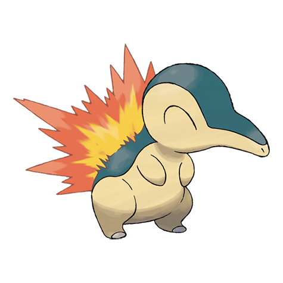

# Cyndaquil (#0155)

*Fire Mouse Pokemon*

**Type:** Fuoco
**Abilities:** [[Blaze]], [[Flash Fire]] *(Hidden)*
**Base HP:** 3

> A shy and elusive Pokemon. The flames from its back protect it. They’ll burn vigorously if Cyndaquil is angry otherwise they’ll remain unlit. It lives in hot dens inside of mountains and volcanoes.

---

## Statistiche (Attributes & Limits)

| Attribute | Base / Limit |
|---|---|
| **Strength** | 2/4 |
| **Dexterity** | 2/4 |
| **Vitality** | 1/3 |
| **Special** | 2/4 |
| **Insight** | 2/4 |

---

## Mosse (Learnset)

- **Starter:** [[Tackle|Tackle]], [[Leer|Leer]]
- **Beginner:** [[Smokescreen|Smokescreen]], [[Ember|Ember]], [[Quick_Attack|Quick Attack]]
- **Amateur:** [[Flame_Wheel|Flame Wheel]], [[Defense_Curl|Defense Curl]], [[Flame_Charge|Flame Charge]], [[Swift|Swift]], [[Lava_Plume|Lava Plume]], [[Flamethrower|Flamethrower]], [[Rollout|Rollout]]
- **Ace:** [[Inferno|Inferno]], [[Double_Edge|Double-Edge]], [[Eruption|Eruption]], [[Burn_Up|Burn Up]]
- **Pro:** [[Howl|Howl]], [[Double_Kick|Double Kick]], [[Fire_Pledge|Fire Pledge]]

---

## Correlati

### Catena Evolutiva
- [[0155_Cyndaquil|Cyndaquil]]
- [[0156_Quilava|Quilava]]
- [[0157_Typhlosion|Typhlosion]]
