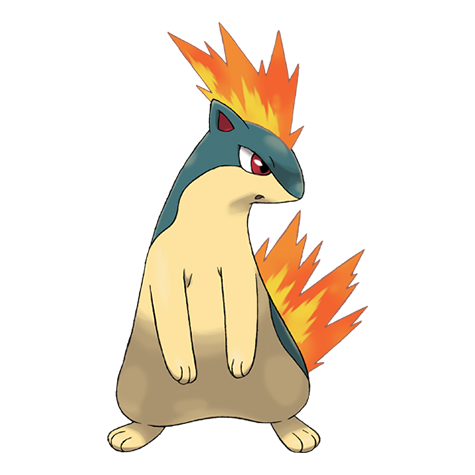

# Quilava (#0156)

*Volcano Pokemon*

**Type:** Fuoco
**Abilities:** [[Blaze]], [[Flash Fire]] *(Hidden)*
**Base HP:** 4

> It intimidates foes with intense gusts of flames and superheated air. Beware if a Quilava turns its back on you, it is planing on using a fire move.

---

## Statistiche (Attributes & Limits)

| Attribute | Base / Limit |
|---|---|
| **Strength** | 2/4 |
| **Dexterity** | 2/5 |
| **Vitality** | 2/4 |
| **Special** | 2/5 |
| **Insight** | 2/4 |

---

## Mosse (Learnset)

- **Starter:** [[Tackle|Tackle]], [[Leer|Leer]]
- **Beginner:** [[Smokescreen|Smokescreen]], [[Ember|Ember]], [[Quick_Attack|Quick Attack]]
- **Amateur:** [[Flame_Wheel|Flame Wheel]], [[Defense_Curl|Defense Curl]], [[Swift|Swift]], [[Flame_Charge|Flame Charge]], [[Lava_Plume|Lava Plume]], [[Flamethrower|Flamethrower]], [[Rollout|Rollout]]
- **Ace:** [[Inferno|Inferno]], [[Double_Edge|Double-Edge]], [[Eruption|Eruption]], [[Burn_Up|Burn Up]]
- **Pro:** [[Howl|Howl]], [[Double_Kick|Double Kick]], [[Fire_Pledge|Fire Pledge]]

---

## Correlati

### Catena Evolutiva
- [[0155_Cyndaquil|Cyndaquil]]
- [[0156_Quilava|Quilava]]
- [[0157_Typhlosion|Typhlosion]]
