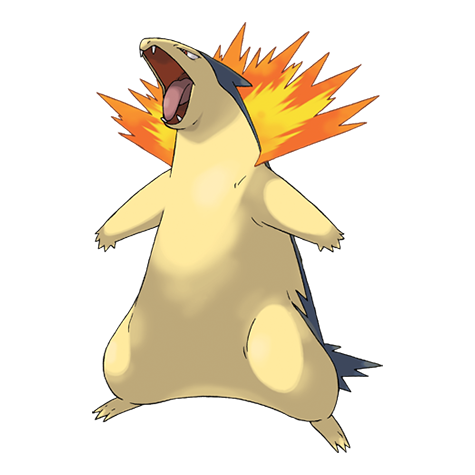

# Typhlosion (#0157)

*Volcano Pokemon*

**Type:** Fuoco
**Abilities:** [[Blaze]], [[Flash Fire]] *(Hidden)*
**Base HP:** 5

> Very rare to see in the wild. It hides behind a shimmering heat haze created using its fire. Typhlosion can create eruptions and explosive blasts that can burn everything to the ground.

---

## Statistiche (Attributes & Limits)

| Attribute | Base / Limit |
|---|---|
| **Strength** | 2/5 |
| **Dexterity** | 3/6 |
| **Vitality** | 2/5 |
| **Special** | 3/6 |
| **Insight** | 2/5 |

---

## Mosse (Learnset)

- **Starter:** [[Leer|Leer]], [[Tackle|Tackle]]
- **Beginner:** [[Smokescreen|Smokescreen]], [[Quick_Attack|Quick Attack]], [[Ember|Ember]]
- **Amateur:** [[Defense_Curl|Defense Curl]], [[Flame_Wheel|Flame Wheel]], [[Flame_Charge|Flame Charge]], [[Swift|Swift]], [[Flamethrower|Flamethrower]], [[Lava_Plume|Lava Plume]], [[Rollout|Rollout]], [[Gyro_Ball|Gyro Ball]]
- **Ace:** [[Inferno|Inferno]], [[Double_Edge|Double-Edge]], [[Eruption|Eruption]], [[Burn_Up|Burn Up]]
- **Pro:** [[Blast_Burn|Blast Burn]], [[Extrasensory|Extrasensory]], [[Thunder_Punch|Thunder Punch]]

---

## Correlati

### Catena Evolutiva
- [[0155_Cyndaquil|Cyndaquil]]
- [[0156_Quilava|Quilava]]
- [[0157_Typhlosion|Typhlosion]]
