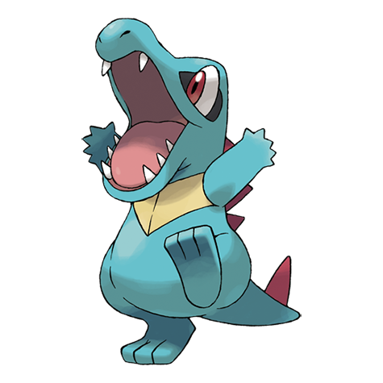

# Totodile (#0158)

*Big Jaw Pokemon*

**Type:** Acqua
**Abilities:** [[Torrent]], [[Sheer Force]] *(Hidden)*
**Base HP:** 3

> Despite its small body, Totodile's jaws are very powerful. While it may think it is just playfully nipping, its bite has enough strength to cause a serious injury. It needs proper discipline to control its biting urges

---

## Statistiche (Attributes & Limits)

| Attribute | Base / Limit |
|---|---|
| **Strength** | 2/4 |
| **Dexterity** | 1/3 |
| **Vitality** | 2/4 |
| **Special** | 1/3 |
| **Insight** | 2/4 |

---

## Mosse (Learnset)

- **Starter:** [[Scratch|Scratch]], [[Leer|Leer]]
- **Beginner:** [[Water_Gun|Water Gun]], [[Rage|Rage]], [[Bite|Bite]]
- **Amateur:** [[Scary_Face|Scary Face]], [[Ice_Fang|Ice Fang]], [[Flail|Flail]], [[Crunch|Crunch]], [[Chip_Away|Chip Away]], [[Slash|Slash]], [[Screech|Screech]], [[Aqua_Tail|Aqua Tail]]
- **Ace:** [[Thrash|Thrash]], [[Superpower|Superpower]], [[Hydro_Pump|Hydro Pump]]
- **Pro:** [[Aqua_Jet|Aqua Jet]], [[Fake_Tears|Fake Tears]], [[Water_Pledge|Water Pledge]]

---

## Correlati

### Catena Evolutiva
- [[0158_Totodile|Totodile]]
- [[0159_Croconaw|Croconaw]]
- [[0160_Feraligatr|Feraligatr]]
