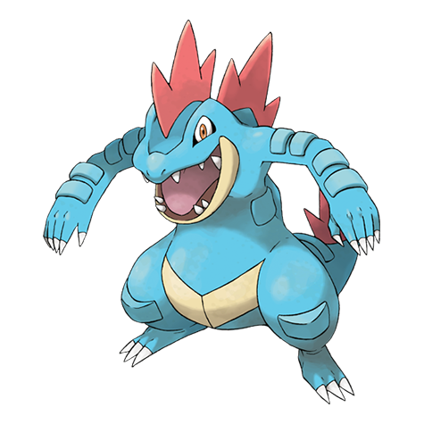

# Feraligatr (#0160)

*Big Jaw Pokemon*

**Type:** Acqua
**Abilities:** [[Torrent]], [[Sheer Force]] *(Hidden)*
**Base HP:** 5

> While in the water, it opens its big jaw to intimidate anyone coming close. Whenever it bites, it shakes its head and savagely rolls to tear up its prey. It is a very dangerous Pokemon. Approach with caution

---

## Statistiche (Attributes & Limits)

| Attribute | Base / Limit |
|---|---|
| **Strength** | 3/6 |
| **Dexterity** | 2/5 |
| **Vitality** | 3/6 |
| **Special** | 2/5 |
| **Insight** | 2/5 |

---

## Mosse (Learnset)

- **Starter:** [[Scratch|Scratch]], [[Leer|Leer]]
- **Beginner:** [[Water_Gun|Water Gun]], [[Rage|Rage]], [[Bite|Bite]]
- **Amateur:** [[Scary_Face|Scary Face]], [[Ice_Fang|Ice Fang]], [[Flail|Flail]], [[Agility|Agility]], [[Crunch|Crunch]], [[Chip_Away|Chip Away]], [[Slash|Slash]], [[Screech|Screech]], [[Aqua_Tail|Aqua Tail]]
- **Ace:** [[Thrash|Thrash]], [[Superpower|Superpower]], [[Hydro_Pump|Hydro Pump]]
- **Pro:** [[Dragon_Dance|Dragon Dance]], [[Hydro_Cannon|Hydro Cannon]], [[Metal_Claw|Metal Claw]]

---

## Correlati

### Catena Evolutiva
- [[0158_Totodile|Totodile]]
- [[0159_Croconaw|Croconaw]]
- [[0160_Feraligatr|Feraligatr]]
