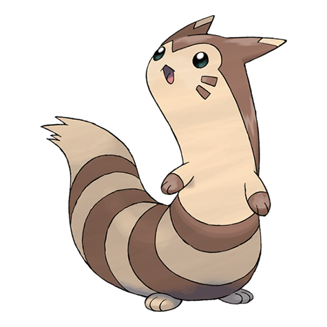

# Furret (#0162)

*Long Body Pokemon*

**Type:** Normale
**Abilities:** [[Run Away]], [[Keen Eye]], [[Frisk]] *(Hidden)*
**Base HP:** 4

> It lives along its Sentret family and acts as the hunter and caregiver of the pack. It can move really fast. If it is cornered, it will squirm through even the narrowest of gaps to escape safe and sound.

---

## Statistiche (Attributes & Limits)

| Attribute | Base / Limit |
|---|---|
| **Strength** | 2/5 |
| **Dexterity** | 2/4 |
| **Vitality** | 2/4 |
| **Special** | 2/4 |
| **Insight** | 2/5 |

---

## Mosse (Learnset)

- **Starter:** [[Scratch|Scratch]], [[Foresight|Foresight]]
- **Beginner:** [[Defense_Curl|Defense Curl]], [[Quick_Attack|Quick Attack]]
- **Amateur:** [[Agility|Agility]], [[Coil|Coil]], [[Fury_Swipes|Fury Swipes]], [[Helping_Hand|Helping Hand]], [[Follow_Me|Follow Me]], [[Slam|Slam]], [[Rest|Rest]], [[Sucker_Punch|Sucker Punch]], [[Amnesia|Amnesia]]
- **Ace:** [[Baton_Pass|Baton Pass]], [[Me_First|Me First]], [[Hyper_Voice|Hyper Voice]]
- **Pro:** [[Slash|Slash]], [[Reversal|Reversal]], [[Iron_Tail|Iron Tail]]

---

## Correlati

### Catena Evolutiva
- [[0161_Sentret|Sentret]]
- [[0162_Furret|Furret]]
