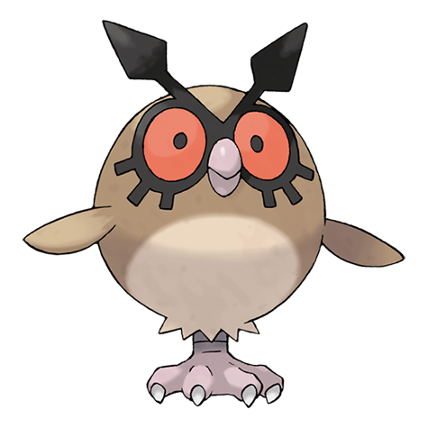

# Hoothoot (#0163)

*Owl Pokemon*

**Type:** Normale / Volante
**Abilities:** [[Insomnia]], [[Keen Eye]], [[Tinted Lens]] *(Hidden)*
**Base HP:** 3

> A nocturnal Pokemon found in dark forests. It has an internal organ that senses the earth’s rotation. By using this special organ a Hoothoot begins hooting at precisely the same time every day.

---

## Statistiche (Attributes & Limits)

| Attribute | Base / Limit |
|---|---|
| **Strength** | 1/3 |
| **Dexterity** | 1/3 |
| **Vitality** | 1/3 |
| **Special** | 2/4 |
| **Insight** | 2/4 |

---

## Mosse (Learnset)

- **Starter:** [[Tackle|Tackle]], [[Growl|Growl]], [[Foresight|Foresight]]
- **Beginner:** [[Hypnosis|Hypnosis]], [[Peck|Peck]]
- **Amateur:** [[Uproar|Uproar]], [[Reflect|Reflect]], [[Confusion|Confusion]], [[Echoed_Voice|Echoed Voice]], [[Take_Down|Take Down]], [[Air_Slash|Air Slash]], [[Zen_Headbutt|Zen Headbutt]], [[Moonblast|Moonblast]], [[Psycho_Shift|Psycho Shift]]
- **Ace:** [[Extrasensory|Extrasensory]], [[Synchronoise|Synchronoise]], [[Roost|Roost]], [[Dream_Eater|Dream Eater]]
- **Pro:** [[Night_Shade|Night Shade]], [[Feint_Attack|Feint Attack]], [[Feather_Dance|Feather Dance]]

---

## Correlati

### Catena Evolutiva
- [[0163_Hoothoot|Hoothoot]]
- [[0164_Noctowl|Noctowl]]
