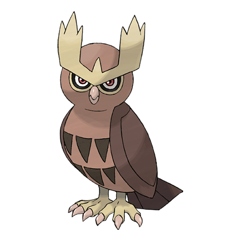

# Noctowl (#0164)

*Owl Pokemon*

**Type:** Normale / Volante
**Abilities:** [[Insomnia]], [[Keen Eye]], [[Tinted Lens]] *(Hidden)*
**Base HP:** 5

> It can hunt in full darkness without fail. All Noctowls owe their success to their superior vision - that allows them to see in minimal light, and to their agile and silent wings. They are very intelligent and critic Pokemon.

---

## Statistiche (Attributes & Limits)

| Attribute | Base / Limit |
|---|---|
| **Strength** | 2/5 |
| **Dexterity** | 2/5 |
| **Vitality** | 2/4 |
| **Special** | 2/5 |
| **Insight** | 3/6 |

---

## Mosse (Learnset)

- **Starter:** [[Growl|Growl]], [[Foresight|Foresight]], [[Tackle|Tackle]]
- **Beginner:** [[Peck|Peck]], [[Hypnosis|Hypnosis]]
- **Amateur:** [[Psycho_Shift|Psycho Shift]], [[Uproar|Uproar]], [[Reflect|Reflect]], [[Confusion|Confusion]], [[Echoed_Voice|Echoed Voice]], [[Take_Down|Take Down]], [[Air_Slash|Air Slash]], [[Zen_Headbutt|Zen Headbutt]], [[Moonblast|Moonblast]]
- **Ace:** [[Synchronoise|Synchronoise]], [[Extrasensory|Extrasensory]], [[Sky_Attack|Sky Attack]], [[Roost|Roost]], [[Dream_Eater|Dream Eater]]
- **Pro:** [[Night_Shade|Night Shade]], [[Feint_Attack|Feint Attack]], [[Agility|Agility]]

---

## Correlati

### Catena Evolutiva
- [[0163_Hoothoot|Hoothoot]]
- [[0164_Noctowl|Noctowl]]
