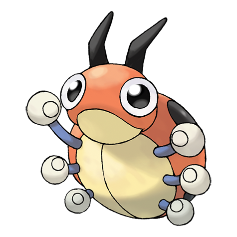

# Ledyba (#0165)

*Five Star Pokemon*

**Type:** Insetto / Volante
**Abilities:** [[Swarm]], [[Early Bird]], [[Rattled]] *(Hidden)*
**Base HP:** 3

> These timid Pokemon swarm in groups to keep each other warm during the winter. It communicates with others through a special scent. They often appear covered in the morning dew.

---

## Statistiche (Attributes & Limits)

| Attribute | Base / Limit |
|---|---|
| **Strength** | 1/3 |
| **Dexterity** | 2/4 |
| **Vitality** | 1/3 |
| **Special** | 1/3 |
| **Insight** | 2/5 |

---

## Mosse (Learnset)

- **Starter:** [[Tackle|Tackle]]
- **Beginner:** [[Supersonic|Supersonic]], [[Comet_Punch|Comet Punch]]
- **Amateur:** [[Light_Screen|Light Screen]], [[Reflect|Reflect]], [[Safeguard|Safeguard]], [[Mach_Punch|Mach Punch]], [[Baton_Pass|Baton Pass]], [[Silver_Wind|Silver Wind]], [[Agility|Agility]], [[Air_Slash|Air Slash]]
- **Ace:** [[Swift|Swift]], [[Double_Edge|Double-Edge]], [[Bug_Buzz|Bug Buzz]]
- **Pro:** [[Giga_Drain|Giga Drain]], [[Screech|Screech]], [[Tailwind|Tailwind]]

---

## Correlati

### Catena Evolutiva
- [[0165_Ledyba|Ledyba]]
- [[0166_Ledian|Ledian]]
