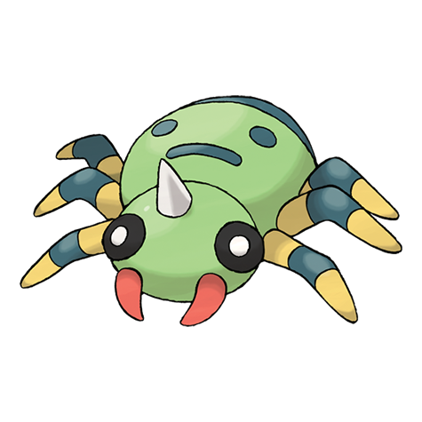

# Spinarak (#0167)

*String Spit Pokemon*

**Type:** Insetto / Veleno
**Abilities:** [[Swarm]], [[Insomnia]], [[Sniper]] *(Hidden)*
**Base HP:** 3

> It sets a trap by spinning a web of thin but strong silk. Then it waits for the prey to arrive. It recognizes what kind of prey has fallen on its web by the vibrations received by each one of its eight legs.

---

## Statistiche (Attributes & Limits)

| Attribute | Base / Limit |
|---|---|
| **Strength** | 2/4 |
| **Dexterity** | 1/3 |
| **Vitality** | 1/3 |
| **Special** | 1/3 |
| **Insight** | 1/3 |

---

## Mosse (Learnset)

- **Starter:** [[Poison_Sting|Poison Sting]], [[String_Shot|String Shot]]
- **Beginner:** [[Scary_Face|Scary Face]], [[Absorb|Absorb]], [[Infestation|Infestation]], [[Constrict|Constrict]]
- **Amateur:** [[Leech_Life|Leech Life]], [[Night_Shade|Night Shade]], [[Shadow_Sneak|Shadow Sneak]], [[Fury_Swipes|Fury Swipes]], [[Sucker_Punch|Sucker Punch]], [[Spider_Web|Spider Web]], [[Agility|Agility]], [[Pin_Missile|Pin Missile]], [[Poison_Jab|Poison Jab]]
- **Ace:** [[Psychic|Psychic]], [[Cross_Poison|Cross Poison]], [[Sticky_Web|Sticky Web]], [[Toxic_Thread|Toxic Thread]]
- **Pro:** [[Electroweb|Electroweb]], [[Bounce|Bounce]], [[Toxic_Spikes|Toxic Spikes]]

---

## Correlati

### Catena Evolutiva
- [[0167_Spinarak|Spinarak]]
- [[0168_Ariados|Ariados]]
