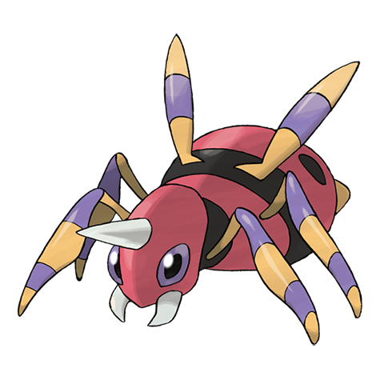

# Ariados (#0168)

*Long Leg Pokemon*

**Type:** Insetto / Veleno
**Abilities:** [[Swarm]], [[Insomnia]], [[Sniper]] *(Hidden)*
**Base HP:** 4

> This Pokemon is silent and stealthy. It comes out at night. After attaching some silk to its prey, it sets it free. Later, it tracks the silk back to the prey and its friends. It can form big colonies in caves.

---

## Statistiche (Attributes & Limits)

| Attribute | Base / Limit |
|---|---|
| **Strength** | 2/5 |
| **Dexterity** | 1/3 |
| **Vitality** | 2/5 |
| **Special** | 2/4 |
| **Insight** | 2/5 |

---

## Mosse (Learnset)

- **Starter:** [[String_Shot|String Shot]], [[Poison_Sting|Poison Sting]]
- **Beginner:** [[Absorb|Absorb]], [[Focus_Energy|Focus Energy]], [[Constrict|Constrict]], [[Scary_Face|Scary Face]], [[Infestation|Infestation]]
- **Amateur:** [[Venom_Drench|Venom Drench]], [[Fell_Stinger|Fell Stinger]], [[Bug_Bite|Bug Bite]], [[Night_Shade|Night Shade]], [[Leech_Life|Leech Life]], [[Fury_Swipes|Fury Swipes]], [[Shadow_Sneak|Shadow Sneak]], [[Spider_Web|Spider Web]], [[Sucker_Punch|Sucker Punch]], [[Pin_Missile|Pin Missile]], [[Agility|Agility]], [[Poison_Jab|Poison Jab]]
- **Ace:** [[Psychic|Psychic]], [[Swords_Dance|Swords Dance]], [[Cross_Poison|Cross Poison]], [[Sticky_Web|Sticky Web]], [[Toxic_Thread|Toxic Thread]]
- **Pro:** [[Night_Slash|Night Slash]], [[Bounce|Bounce]], [[Electroweb|Electroweb]]

---

## Correlati

### Catena Evolutiva
- [[0167_Spinarak|Spinarak]]
- [[0168_Ariados|Ariados]]
