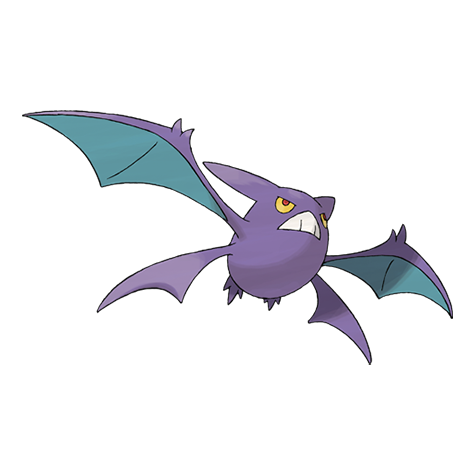

# Crobat (#0169)

*Bat Pokemon*

**Type:** Veleno / Volante
**Abilities:** [[Inner Focus]], [[Infiltrator]] *(Hidden)*
**Base HP:** 5

> Very rare in the wild. People have called it a vampire. It sneaks up on its intended prey using wings that barely make a sound. Crobat is a surprisingly loyal Pokemon.

---

## Statistiche (Attributes & Limits)

| Attribute | Base / Limit |
|---|---|
| **Strength** | 2/5 |
| **Dexterity** | 3/7 |
| **Vitality** | 2/5 |
| **Special** | 2/5 |
| **Insight** | 2/5 |

---

## Mosse (Learnset)

- **Starter:** [[Absorb|Absorb]], [[Screech|Screech]], [[Astonish|Astonish]], [[Supersonic|Supersonic]]
- **Beginner:** [[Wing_Attack|Wing Attack]], [[Bite|Bite]]
- **Amateur:** [[Swift|Swift]], [[Confuse_Ray|Confuse Ray]], [[Acrobatics|Acrobatics]], [[Air_Cutter|Air Cutter]], [[Mean_Look|Mean Look]], [[Leech_Life|Leech Life]], [[Poison_Fang|Poison Fang]]
- **Ace:** [[Cross_Poison|Cross Poison]], [[Haze|Haze]], [[Air_Slash|Air Slash]]
- **Pro:** [[Brave_Bird|Brave Bird]], [[Nasty_Plot|Nasty Plot]], [[Heat_Wave|Heat Wave]]

---

