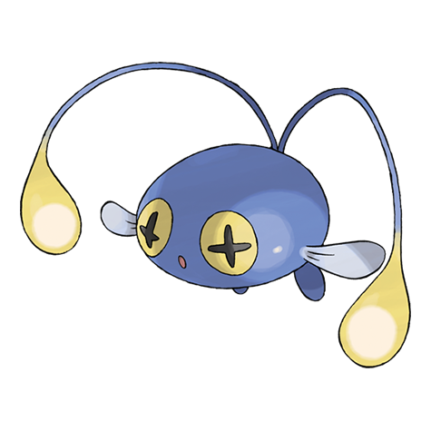

# Chinchou (#0170)

*Angler Pokemon*

**Type:** Acqua / Elettro
**Abilities:** [[Volt Absorb]], [[Illuminate]], [[Water Absorb]] *(Hidden)*
**Base HP:** 3

> In the dark ocean floor, its only mean of communication is to constantly flash its lights. It is a clumsy but friendly Pokemon. Its antennae can be used to power up small electric appliances.

---

## Statistiche (Attributes & Limits)

| Attribute | Base / Limit |
|---|---|
| **Strength** | 1/3 |
| **Dexterity** | 2/4 |
| **Vitality** | 1/3 |
| **Special** | 2/4 |
| **Insight** | 2/4 |

---

## Mosse (Learnset)

- **Starter:** [[Water_Gun|Water Gun]], [[Supersonic|Supersonic]]
- **Beginner:** [[Thunder_Wave|Thunder Wave]], [[Flail|Flail]], [[Bubble|Bubble]], [[Confuse_Ray|Confuse Ray]]
- **Amateur:** [[Spark|Spark]], [[Take_Down|Take Down]], [[Electro_Ball|Electro Ball]], [[Bubble_Beam|Bubble Beam]], [[Signal_Beam|Signal Beam]]
- **Ace:** [[Discharge|Discharge]], [[Aqua_Ring|Aqua Ring]], [[Hydro_Pump|Hydro Pump]], [[Ion_Deluge|Ion Deluge]], [[Charge|Charge]]
- **Pro:** [[Agility|Agility]], [[Soak|Soak]], [[Psybeam|Psybeam]]

---

## Correlati

### Catena Evolutiva
- [[0170_Chinchou|Chinchou]]
- [[0171_Lanturn|Lanturn]]
