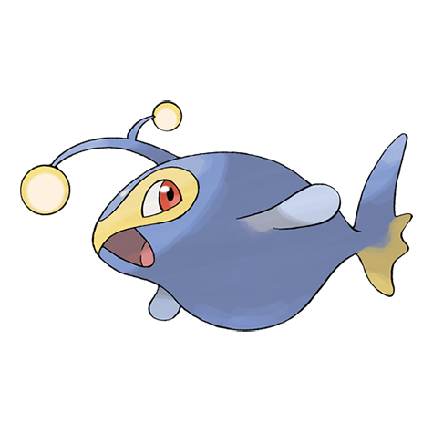

# Lanturn (#0171)

*Light Pokemon*

**Type:** Acqua / Elettro
**Abilities:** [[Volt Absorb]], [[Illuminate]], [[Water Absorb]] *(Hidden)*
**Base HP:** 6

> It is known for its soft light glow. They are not aggressive Pokemon. If you look into the dark sea at night you can sometimes see this Pokemon’s light rising from the depths, making the sea look like a starry night.

---

## Statistiche (Attributes & Limits)

| Attribute | Base / Limit |
|---|---|
| **Strength** | 2/4 |
| **Dexterity** | 2/4 |
| **Vitality** | 2/4 |
| **Special** | 2/5 |
| **Insight** | 2/5 |

---

## Mosse (Learnset)

- **Starter:** [[Supersonic|Supersonic]], [[Water_Gun|Water Gun]]
- **Beginner:** [[Flail|Flail]], [[Thunder_Wave|Thunder Wave]], [[Confuse_Ray|Confuse Ray]], [[Bubble|Bubble]]
- **Amateur:** [[Eerie_Impulse|Eerie Impulse]], [[Spark|Spark]], [[Take_Down|Take Down]], [[Stockpile|Stockpile]], [[Swallow|Swallow]], [[Spit_Up|Spit Up]], [[Electro_Ball|Electro Ball]], [[Bubble_Beam|Bubble Beam]], [[Signal_Beam|Signal Beam]], [[Charge|Charge]]
- **Ace:** [[Aqua_Ring|Aqua Ring]], [[Discharge|Discharge]], [[Ion_Deluge|Ion Deluge]], [[Hydro_Pump|Hydro Pump]]
- **Pro:** [[Agility|Agility]], [[Soak|Soak]], [[Psybeam|Psybeam]]

---

## Correlati

### Catena Evolutiva
- [[0170_Chinchou|Chinchou]]
- [[0171_Lanturn|Lanturn]]
