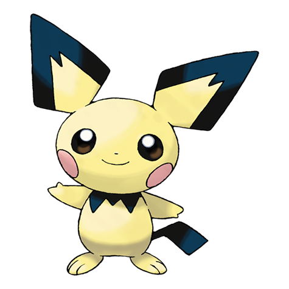

# Pichu (#0172)

*Tiny Mouse Pokemon*

**Type:** Elettro
**Abilities:** [[Static]], [[Lightning Rod]] *(Hidden)*
**Base HP:** 3

> Its cheek pouches are not fully developed yet. Pichu gets startled if its cheeks release electricity jolts. It needs a friendly environment to grow happy. It can be quite the rascal, though.

---

## Statistiche (Attributes & Limits)

| Attribute | Base / Limit |
|---|---|
| **Strength** | 1/3 |
| **Dexterity** | 2/4 |
| **Vitality** | 1/2 |
| **Special** | 1/3 |
| **Insight** | 1/3 |

---

## Mosse (Learnset)

- **Starter:** [[Thunder_Shock|Thunder Shock]], [[Charm|Charm]]
- **Beginner:** [[Tail_Whip|Tail Whip]], [[Sweet_Kiss|Sweet Kiss]]
- **Amateur:** [[Thunder_Wave|Thunder Wave]], [[Nasty_Plot|Nasty Plot]], [[Charge|Charge]]
- **Ace:** [[Fake_Out|Fake Out]]
- **Pro:** [[Disarming_Voice|Disarming Voice]]

---

## Correlati

### Catena Evolutiva
- [[0172_Pichu|Pichu]]
- [[0025_Pikachu|Pikachu]]
