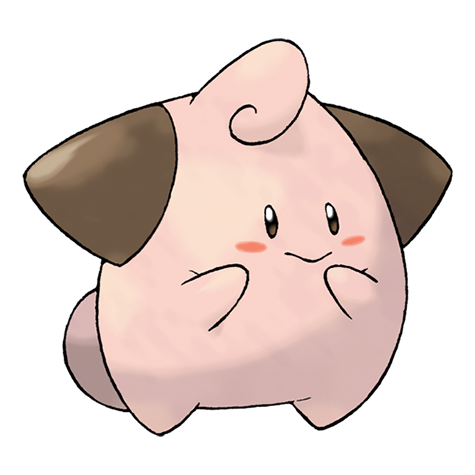

# Cleffa (#0173)

*Star Shape Pokemon*

**Type:** Folletto
**Abilities:** [[Cute Charm]], [[Magic Guard]], [[Friend Guard]] *(Hidden)*
**Base HP:** 3

> An extremely elusive Pokemon. A few have appeared when the night skies are filled with shooting stars - but they always disappear at dawn. Friendship and love allows it to go into the next step of life.

---

## Statistiche (Attributes & Limits)

| Attribute | Base / Limit |
|---|---|
| **Strength** | 1/3 |
| **Dexterity** | 1/2 |
| **Vitality** | 1/3 |
| **Special** | 2/4 |
| **Insight** | 2/4 |

---

## Mosse (Learnset)

- **Starter:** [[Pound|Pound]], [[Charm|Charm]]
- **Beginner:** [[Encore|Encore]], [[Sweet_Kiss|Sweet Kiss]]
- **Amateur:** [[Sing|Sing]], [[Copycat|Copycat]], [[Tickle|Tickle]], [[Fake_Tears|Fake Tears]]
- **Ace:** [[Magical_Leaf|Magical Leaf]]
- **Pro:** [[Wonder_Room|Wonder Room]]

---

## Correlati

### Catena Evolutiva
- [[0173_Cleffa|Cleffa]]
- [[0035_Clefairy|Clefairy]]
