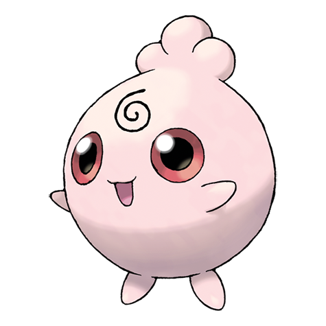

# Igglybuff (#0174)

*Balloon Pokemon*

**Type:** Normale / Folletto
**Abilities:** [[Cute Charm]], [[Competitive]], [[Friend Guard]] *(Hidden)*
**Base HP:** 3

> It has a very light body that makes it float and bounce. If you are not careful it can bounce away without control. After being bottle fed it will not bounce but wiggle around. It gets cranky if it doesn’t take a nap.

---

## Statistiche (Attributes & Limits)

| Attribute | Base / Limit |
|---|---|
| **Strength** | 1/3 |
| **Dexterity** | 1/2 |
| **Vitality** | 1/2 |
| **Special** | 1/3 |
| **Insight** | 1/3 |

---

## Mosse (Learnset)

- **Starter:** [[Sing|Sing]], [[Charm|Charm]]
- **Beginner:** [[Defense_Curl|Defense Curl]], [[Pound|Pound]]
- **Amateur:** [[Sweet_Kiss|Sweet Kiss]], [[Copycat|Copycat]]
- **Ace:** [[Hyper_Voice|Hyper Voice]], [[Bounce|Bounce]]
- **Pro:** [[Perish_Song|Perish Song]]

---

## Correlati

### Catena Evolutiva
- [[0174_Igglybuff|Igglybuff]]
- [[0039_Jigglypuff|Jigglypuff]]
