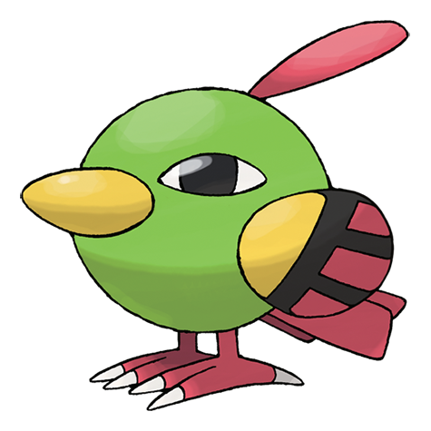

# Natu (#0177)

*Little Bird Pokemon*

**Type:** Psico / Volante
**Abilities:** [[Synchronize]], [[Early Bird]], [[Magic Bounce]] *(Hidden)*
**Base HP:** 3

> It lives close to the deserts. Its wings are not fully developed so it hops to trees and cactus to peck something to eat. If you find one it will hold your stare, if you get closer it might disappear in an instant.

---

## Statistiche (Attributes & Limits)

| Attribute | Base / Limit |
|---|---|
| **Strength** | 2/4 |
| **Dexterity** | 2/5 |
| **Vitality** | 2/4 |
| **Special** | 2/5 |
| **Insight** | 2/4 |

---

## Mosse (Learnset)

- **Starter:** [[Peck|Peck]], [[Leer|Leer]]
- **Beginner:** [[Night_Shade|Night Shade]], [[Teleport|Teleport]]
- **Amateur:** [[Lucky_Chant|Lucky Chant]], [[Miracle_Eye|Miracle Eye]], [[Me_First|Me First]], [[Confuse_Ray|Confuse Ray]], [[Ominous_Wind|Ominous Wind]], [[Psycho_Shift|Psycho Shift]], [[Stored_Power|Stored Power]]
- **Ace:** [[Future_Sight|Future Sight]], [[Wish|Wish]], [[Power_Swap|Power Swap]], [[Guard_Swap|Guard Swap]], [[Psychic|Psychic]]
- **Pro:** [[Pain_Split|Pain Split]], [[Twister|Twister]], [[Haze|Haze]]

---

## Correlati

### Catena Evolutiva
- [[0177_Natu|Natu]]
- [[0178_Xatu|Xatu]]
