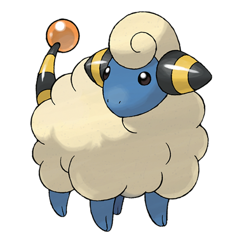

# Mareep (#0179)

*Wool Pokemon*

**Type:** Elettro
**Abilities:** [[Static]], [[Plus]] *(Hidden)*
**Base HP:** 3

> Its fluffy coat of wool builds a static charge, the more static electricity, the more brightly the lightbulb at the tip of its tail glows. Farmers shed their wool by the summer but it grows back quickly.

---

## Statistiche (Attributes & Limits)

| Attribute | Base / Limit |
|---|---|
| **Strength** | 1/3 |
| **Dexterity** | 1/3 |
| **Vitality** | 1/3 |
| **Special** | 2/4 |
| **Insight** | 2/4 |

---

## Mosse (Learnset)

- **Starter:** [[Tackle|Tackle]], [[Growl|Growl]]
- **Beginner:** [[Thunder_Wave|Thunder Wave]], [[Thunder_Shock|Thunder Shock]]
- **Amateur:** [[Cotton_Spore|Cotton Spore]], [[Charge|Charge]], [[Take_Down|Take Down]], [[Electro_Ball|Electro Ball]], [[Confuse_Ray|Confuse Ray]], [[Power_Gem|Power Gem]], [[Signal_Beam|Signal Beam]]
- **Ace:** [[Cotton_Guard|Cotton Guard]], [[Discharge|Discharge]], [[Light_Screen|Light Screen]], [[Thunder|Thunder]]
- **Pro:** [[Agility|Agility]], [[Magnet_Rise|Magnet Rise]], [[Heal_Bell|Heal Bell]]

---

## Correlati

### Catena Evolutiva
- [[0179_Mareep|Mareep]]
- [[0180_Flaaffy|Flaaffy]]
- [[0181_Ampharos|Ampharos]]
- Ampharos (Mega Form)
