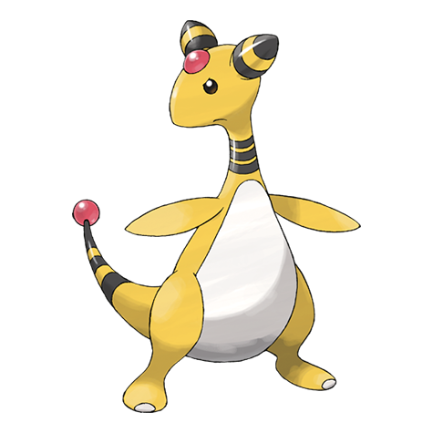

# Ampharos (#0181)

*Light Pokemon*

**Type:** Elettro
**Abilities:** [[Static]], [[Plus]] *(Hidden)*
**Base HP:** 5

> It’s not common to see it in the wild. The tip of its tail shines brightly and in the old days, people sent light signals with the help of this Pokemon. It has a good disposition towards people in general.

---

## Statistiche (Attributes & Limits)

| Attribute | Base / Limit |
|---|---|
| **Strength** | 2/5 |
| **Dexterity** | 2/4 |
| **Vitality** | 2/5 |
| **Special** | 3/6 |
| **Insight** | 2/5 |

---

## Mosse (Learnset)

- **Starter:** [[Tackle|Tackle]], [[Growl|Growl]]
- **Beginner:** [[Thunder_Wave|Thunder Wave]], [[Thunder_Shock|Thunder Shock]]
- **Amateur:** [[Magnetic_Flux|Magnetic Flux]], [[Ion_Deluge|Ion Deluge]], [[Dragon_Pulse|Dragon Pulse]], [[Fire_Punch|Fire Punch]], [[Cotton_Spore|Cotton Spore]], [[Charge|Charge]], [[Take_Down|Take Down]], [[Electro_Ball|Electro Ball]], [[Confuse_Ray|Confuse Ray]], [[Thunder_Punch|Thunder Punch]], [[Power_Gem|Power Gem]], [[Signal_Beam|Signal Beam]]
- **Ace:** [[Cotton_Guard|Cotton Guard]], [[Discharge|Discharge]], [[Light_Screen|Light Screen]], [[Thunder|Thunder]]
- **Pro:** [[Heal_Bell|Heal Bell]], [[Magnet_Rise|Magnet Rise]], [[Outrage|Outrage]]

---

## Correlati

### Catena Evolutiva
- [[0179_Mareep|Mareep]]
- [[0180_Flaaffy|Flaaffy]]
- [[0181_Ampharos|Ampharos]]
- Ampharos (Mega Form)
