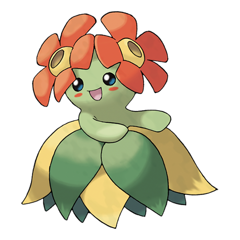

# Bellossom (#0182)

*Flower Pokemon*

**Type:** Erba
**Abilities:** [[Chlorophyll]], [[Healer]] *(Hidden)*
**Base HP:** 5

> They are plentiful in tropical areas. The beauty of the flowers on its head depends on how stinky it was as a Gloom. Lots of sunshine will make the skirt leaves swirl in a beautiful and rhythmic dance.

---

## Statistiche (Attributes & Limits)

| Attribute | Base / Limit |
|---|---|
| **Strength** | 2/5 |
| **Dexterity** | 2/4 |
| **Vitality** | 2/5 |
| **Special** | 2/5 |
| **Insight** | 3/6 |

---

## Mosse (Learnset)

- **Starter:** [[Sweet_Scent|Sweet Scent]]
- **Beginner:** [[Stun_Spore|Stun Spore]], [[Leaf_Blade|Leaf Blade]]
- **Amateur:** [[Mega_Drain|Mega Drain]], [[Sunny_Day|Sunny Day]], [[Magical_Leaf|Magical Leaf]], [[Quiver_Dance|Quiver Dance]]
- **Ace:** [[Petal_Blizzard|Petal Blizzard]], [[Leaf_Storm|Leaf Storm]]
- **Pro:** [[Teeter_Dance|Teeter Dance]], [[Swords_Dance|Swords Dance]], [[Drain_Punch|Drain Punch]]

---

