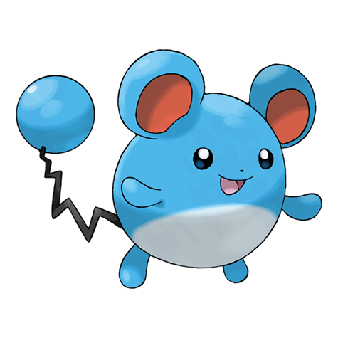

# Marill (#0183)

*Aquamouse Pokemon*

**Type:** Acqua / Folletto
**Abilities:** [[Thick Fat]], [[Huge Power]], [[Sap Sipper]] *(Hidden)*
**Base HP:** 4

> Marill's tail acts like a floater. Seeing its tail bobbing on the water’s surface is a sure indication that this Pokemon is diving to feed on algae and aquatic plants. This Pokemon is curious towards humans.

---

## Statistiche (Attributes & Limits)

| Attribute | Base / Limit |
|---|---|
| **Strength** | 1/3 |
| **Dexterity** | 1/3 |
| **Vitality** | 2/4 |
| **Special** | 1/3 |
| **Insight** | 2/4 |

---

## Mosse (Learnset)

- **Starter:** [[Tackle|Tackle]], [[Water_Gun|Water Gun]]
- **Beginner:** [[Tail_Whip|Tail Whip]], [[Water_Sport|Water Sport]], [[Bubble|Bubble]]
- **Amateur:** [[Defense_Curl|Defense Curl]], [[Rollout|Rollout]], [[Bubble_Beam|Bubble Beam]], [[Helping_Hand|Helping Hand]], [[Aqua_Tail|Aqua Tail]], [[Rain_Dance|Rain Dance]], [[Play_Rough|Play Rough]]
- **Ace:** [[Double_Edge|Double-Edge]], [[Aqua_Ring|Aqua Ring]], [[Hydro_Pump|Hydro Pump]], [[Superpower|Superpower]]
- **Pro:** [[Belly_Drum|Belly Drum]], [[Aqua_Jet|Aqua Jet]], [[Ice_Punch|Ice Punch]]

---

## Correlati

### Catena Evolutiva
- [[0183_Marill|Marill]]
- [[0184_Azumarill|Azumarill]]
