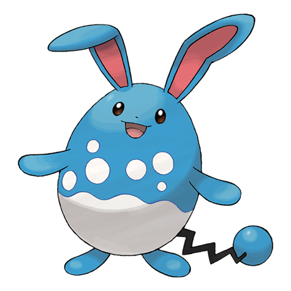

# Azumarill (#0184)

*Aquarabbit Pokemon*

**Type:** Acqua / Folletto
**Abilities:** [[Thick Fat]], [[Huge Power]], [[Sap Sipper]] *(Hidden)*
**Base HP:** 5

> It stays in water virtually all day long. Its blue fur makes it difficult to spot when submerged. Azumarril uses its sensitive ears to locate prey even underwater. They are not aggressive and even get close to humans.

---

## Statistiche (Attributes & Limits)

| Attribute | Base / Limit |
|---|---|
| **Strength** | 2/4 |
| **Dexterity** | 2/4 |
| **Vitality** | 2/5 |
| **Special** | 2/4 |
| **Insight** | 2/5 |

---

## Mosse (Learnset)

- **Starter:** [[Tackle|Tackle]], [[Water_Gun|Water Gun]]
- **Beginner:** [[Tail_Whip|Tail Whip]], [[Water_Sport|Water Sport]], [[Bubble|Bubble]]
- **Amateur:** [[Defense_Curl|Defense Curl]], [[Rollout|Rollout]], [[Bubble_Beam|Bubble Beam]], [[Helping_Hand|Helping Hand]], [[Aqua_Tail|Aqua Tail]], [[Rain_Dance|Rain Dance]], [[Play_Rough|Play Rough]]
- **Ace:** [[Double_Edge|Double-Edge]], [[Superpower|Superpower]], [[Hydro_Pump|Hydro Pump]], [[Aqua_Ring|Aqua Ring]]
- **Pro:** [[Belly_Drum|Belly Drum]], [[Aqua_Jet|Aqua Jet]], [[Ice_Punch|Ice Punch]]

---

## Correlati

### Catena Evolutiva
- [[0183_Marill|Marill]]
- [[0184_Azumarill|Azumarill]]
