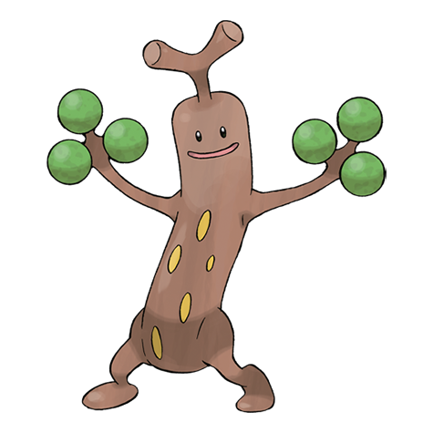

# Sudowoodo (#0185)

*Imitation Pokemon*

**Type:** Roccia
**Abilities:** [[Sturdy]], [[Rock Head]], [[Rattled]] *(Hidden)*
**Base HP:** 4

> Sudowoodo camouflages itself as a tree to avoid being attacked by enemies. However, because its arms remain green throughout the year, this Pokemon is easy to identify in winter. It’s a little wary of humans.

---

## Statistiche (Attributes & Limits)

| Attribute | Base / Limit |
|---|---|
| **Strength** | 3/6 |
| **Dexterity** | 1/3 |
| **Vitality** | 3/6 |
| **Special** | 1/3 |
| **Insight** | 2/4 |

---

## Mosse (Learnset)

- **Starter:** [[Flail|Flail]], [[Rock_Throw|Rock Throw]]
- **Beginner:** [[Low_Kick|Low Kick]], [[Mimic|Mimic]]
- **Amateur:** [[Wood_Hammer|Wood Hammer]], [[Copycat|Copycat]], [[Slam|Slam]], [[Feint_Attack|Feint Attack]], [[Rock_Tomb|Rock Tomb]], [[Tearful_Look|Tearful Look]], [[Block|Block]], [[Counter|Counter]]
- **Ace:** [[Rock_Slide|Rock Slide]], [[Sucker_Punch|Sucker Punch]], [[Double_Edge|Double-Edge]], [[Stone_Edge|Stone Edge]], [[Hammer_Arm|Hammer Arm]], [[Head_Smash|Head Smash]]
- **Pro:** [[Fire_Punch|Fire Punch]], [[Stealth_Rock|Stealth Rock]], [[Self_Destruct|Self Destruct]]

---

