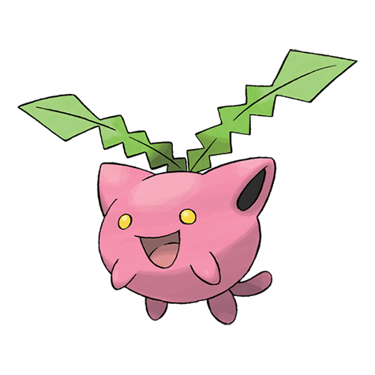

# Hoppip (#0187)

*Cottonweed Pokemon*

**Type:** Erba / Volante
**Abilities:** [[Chlorophyll]], [[Leaf Guard]], [[Infiltrator]] *(Hidden)*
**Base HP:** 3

> This Pokemon drifts away by floating in the wind. Even the weakest current can lift them up. By the end of the winter you can see them flying above cities and fields. This means that spring is coming soon.

---

## Statistiche (Attributes & Limits)

| Attribute | Base / Limit |
|---|---|
| **Strength** | 1/3 |
| **Dexterity** | 2/4 |
| **Vitality** | 1/3 |
| **Special** | 1/3 |
| **Insight** | 2/4 |

---

## Mosse (Learnset)

- **Starter:** [[Splash|Splash]]
- **Beginner:** [[Synthesis|Synthesis]], [[Tail_Whip|Tail Whip]], [[Tackle|Tackle]]
- **Amateur:** [[Fairy_Wind|Fairy Wind]], [[Poison_Powder|Poison Powder]], [[Stun_Spore|Stun Spore]], [[Sleep_Powder|Sleep Powder]], [[Bullet_Seed|Bullet Seed]], [[Leech_Seed|Leech Seed]], [[Mega_Drain|Mega Drain]], [[Acrobatics|Acrobatics]], [[Rage_Powder|Rage Powder]]
- **Ace:** [[Worry_Seed|Worry Seed]], [[Giga_Drain|Giga Drain]], [[Bounce|Bounce]], [[Memento|Memento]]
- **Pro:** [[Silver_Wind|Silver Wind]], [[Seed_Bomb|Seed Bomb]], [[Aromatherapy|Aromatherapy]]

---

## Correlati

### Catena Evolutiva
- [[0187_Hoppip|Hoppip]]
- [[0188_Skiploom|Skiploom]]
- [[0189_Jumpluff|Jumpluff]]
