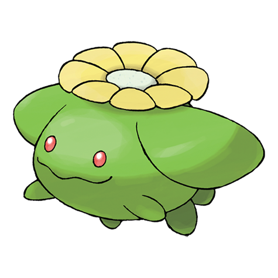

# Skiploom (#0188)

*Cottonweed Pokemon*

**Type:** Erba / Volante
**Abilities:** [[Chlorophyll]], [[Leaf Guard]], [[Infiltrator]] *(Hidden)*
**Base HP:** 4

> It blooms when the weather is warm. If the weather gets cold, the bloom will close and it will stop flying. This is not an aggressive Pokemon but it can cause allergies if it floats directly above you.

---

## Statistiche (Attributes & Limits)

| Attribute | Base / Limit |
|---|---|
| **Strength** | 2/4 |
| **Dexterity** | 2/5 |
| **Vitality** | 2/4 |
| **Special** | 2/4 |
| **Insight** | 2/4 |

---

## Mosse (Learnset)

- **Starter:** [[Splash|Splash]]
- **Beginner:** [[Synthesis|Synthesis]], [[Tail_Whip|Tail Whip]], [[Tackle|Tackle]]
- **Amateur:** [[Fairy_Wind|Fairy Wind]], [[Poison_Powder|Poison Powder]], [[Stun_Spore|Stun Spore]], [[Sleep_Powder|Sleep Powder]], [[Bullet_Seed|Bullet Seed]], [[Leech_Seed|Leech Seed]], [[Mega_Drain|Mega Drain]], [[Acrobatics|Acrobatics]], [[Rage_Powder|Rage Powder]]
- **Ace:** [[Cotton_Spore|Cotton Spore]], [[U_Turn|U-Turn]], [[Worry_Seed|Worry Seed]], [[Giga_Drain|Giga Drain]], [[Bounce|Bounce]], [[Memento|Memento]]
- **Pro:** [[Silver_Wind|Silver Wind]], [[Seed_Bomb|Seed Bomb]], [[Aromatherapy|Aromatherapy]]

---

## Correlati

### Catena Evolutiva
- [[0187_Hoppip|Hoppip]]
- [[0188_Skiploom|Skiploom]]
- [[0189_Jumpluff|Jumpluff]]
