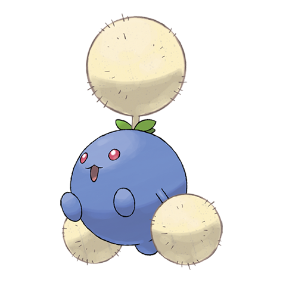

# Jumpluff (#0189)

*Cottonweed Pokemon*

**Type:** Erba / Volante
**Abilities:** [[Chlorophyll]], [[Leaf Guard]], [[Infiltrator]] *(Hidden)*
**Base HP:** 5

> It flies along the wind and spreads its cotton-like spores all over the world to make more offspring. It is always looking for warm places, if it gets caught by a cold front, it will land to find shelter.

---

## Statistiche (Attributes & Limits)

| Attribute | Base / Limit |
|---|---|
| **Strength** | 2/4 |
| **Dexterity** | 3/6 |
| **Vitality** | 2/5 |
| **Special** | 2/4 |
| **Insight** | 2/5 |

---

## Mosse (Learnset)

- **Starter:** [[Splash|Splash]]
- **Beginner:** [[Synthesis|Synthesis]], [[Tail_Whip|Tail Whip]], [[Tackle|Tackle]]
- **Amateur:** [[Fairy_Wind|Fairy Wind]], [[Poison_Powder|Poison Powder]], [[Stun_Spore|Stun Spore]], [[Sleep_Powder|Sleep Powder]], [[Bullet_Seed|Bullet Seed]], [[Leech_Seed|Leech Seed]], [[Mega_Drain|Mega Drain]], [[Acrobatics|Acrobatics]], [[Rage_Powder|Rage Powder]]
- **Ace:** [[Cotton_Spore|Cotton Spore]], [[U_Turn|U-Turn]], [[Worry_Seed|Worry Seed]], [[Giga_Drain|Giga Drain]], [[Bounce|Bounce]], [[Memento|Memento]]
- **Pro:** [[Cotton_Guard|Cotton Guard]], [[Grassy_Terrain|Grassy Terrain]], [[Swords_Dance|Swords Dance]]

---

## Correlati

### Catena Evolutiva
- [[0187_Hoppip|Hoppip]]
- [[0188_Skiploom|Skiploom]]
- [[0189_Jumpluff|Jumpluff]]
