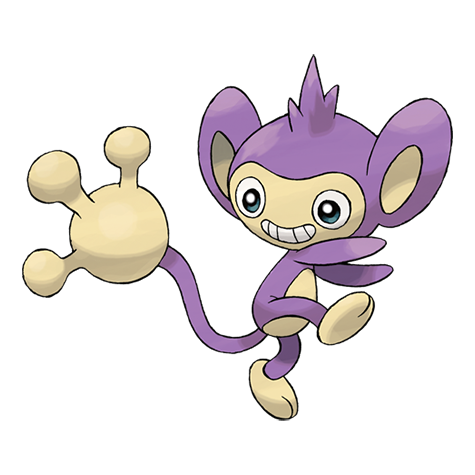

# Aipom (#0190)

*Long Tail Pokemon*

**Type:** Normale
**Abilities:** [[Run Away]], [[Pickup]], [[Skill Link]] *(Hidden)*
**Base HP:** 3

> It lives at the top of tall trees in forests and jungles. It uses its tail tip as a third hand. However, because the Pokemon uses its tail so much, its real hands become rather clumsy. It is very playful.

---

## Statistiche (Attributes & Limits)

| Attribute | Base / Limit |
|---|---|
| **Strength** | 2/5 |
| **Dexterity** | 2/5 |
| **Vitality** | 2/4 |
| **Special** | 1/3 |
| **Insight** | 2/4 |

---

## Mosse (Learnset)

- **Starter:** [[Tackle|Tackle]], [[Tail_Whip|Tail Whip]]
- **Beginner:** [[Sand_Attack|Sand Attack]], [[Astonish|Astonish]]
- **Amateur:** [[Baton_Pass|Baton Pass]], [[Tickle|Tickle]], [[Fury_Swipes|Fury Swipes]], [[Swift|Swift]], [[Screech|Screech]], [[Agility|Agility]], [[Fling|Fling]]
- **Ace:** [[Double_Hit|Double Hit]], [[Nasty_Plot|Nasty Plot]], [[Last_Resort|Last Resort]]
- **Pro:** [[Fake_Out|Fake Out]], [[Beat_Up|Beat Up]], [[Quick_Guard|Quick Guard]]

---

## Correlati

### Catena Evolutiva
- [[0190_Aipom|Aipom]]
- Ambipom
