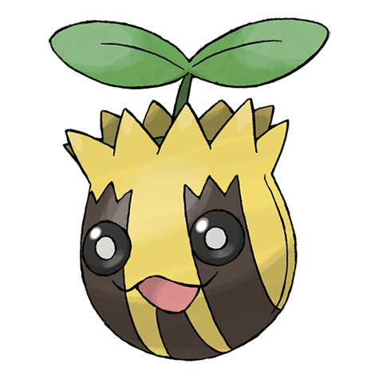

# Sunkern (#0191)

*Seed Pokemon*

**Type:** Erba
**Abilities:** [[Chlorophyll]], [[Solar Power]], [[Early Bird]] *(Hidden)*
**Base HP:** 3

> They suddenly appear after a cold winter. They survive by drinking only dewdrops from under the leaves of plants. It tries not to move a lot since lots of bird Pokemon prey on them.

---

## Statistiche (Attributes & Limits)

| Attribute | Base / Limit |
|---|---|
| **Strength** | 1/3 |
| **Dexterity** | 1/3 |
| **Vitality** | 1/3 |
| **Special** | 1/3 |
| **Insight** | 1/3 |

---

## Mosse (Learnset)

- **Starter:** [[Absorb|Absorb]], [[Growth|Growth]]
- **Beginner:** [[Ingrain|Ingrain]], [[Grass_Whistle|Grass Whistle]], [[Mega_Drain|Mega Drain]]
- **Amateur:** [[Leech_Seed|Leech Seed]], [[Razor_Leaf|Razor Leaf]], [[Worry_Seed|Worry Seed]], [[Giga_Drain|Giga Drain]], [[Endeavor|Endeavor]], [[Natural_Gift|Natural Gift]]
- **Ace:** [[Synthesis|Synthesis]], [[Solar_Beam|Solar Beam]], [[Double_Edge|Double-Edge]], [[Sunny_Day|Sunny Day]], [[Seed_Bomb|Seed Bomb]]
- **Pro:** [[Swords_Dance|Swords Dance]], [[Endure|Endure]], [[Grassy_Terrain|Grassy Terrain]]

---

## Correlati

### Catena Evolutiva
- [[0191_Sunkern|Sunkern]]
- [[0192_Sunflora|Sunflora]]
