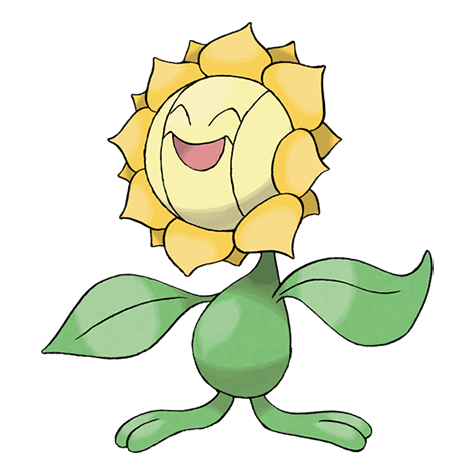

# Sunflora (#0192)

*Sun Pokemon*

**Type:** Erba
**Abilities:** [[Chlorophyll]], [[Solar Power]], [[Early Bird]] *(Hidden)*
**Base HP:** 4

> Sunfloras live in flower patches. They convert solar energy into nutrition and are highly active in the warm daytime but suddenly stop moving as soon as the sun sets, closing their petals to cover their face.

---

## Statistiche (Attributes & Limits)

| Attribute | Base / Limit |
|---|---|
| **Strength** | 2/5 |
| **Dexterity** | 1/3 |
| **Vitality** | 2/4 |
| **Special** | 3/6 |
| **Insight** | 2/5 |

---

## Mosse (Learnset)

- **Starter:** [[Absorb|Absorb]], [[Growth|Growth]], [[Pound|Pound]]
- **Beginner:** [[Grass_Whistle|Grass Whistle]], [[Ingrain|Ingrain]], [[Mega_Drain|Mega Drain]]
- **Amateur:** [[Flower_Shield|Flower Shield]], [[Leech_Seed|Leech Seed]], [[Razor_Leaf|Razor Leaf]], [[Worry_Seed|Worry Seed]], [[Giga_Drain|Giga Drain]], [[Bullet_Seed|Bullet Seed]], [[Natural_Gift|Natural Gift]]
- **Ace:** [[Petal_Dance|Petal Dance]], [[Solar_Beam|Solar Beam]], [[Double_Edge|Double-Edge]], [[Sunny_Day|Sunny Day]], [[Leaf_Storm|Leaf Storm]], [[Petal_Blizzard|Petal Blizzard]]
- **Pro:** [[Swords_Dance|Swords Dance]], [[Morning_Sun|Morning Sun]], [[Endure|Endure]]

---

## Correlati

### Catena Evolutiva
- [[0191_Sunkern|Sunkern]]
- [[0192_Sunflora|Sunflora]]
