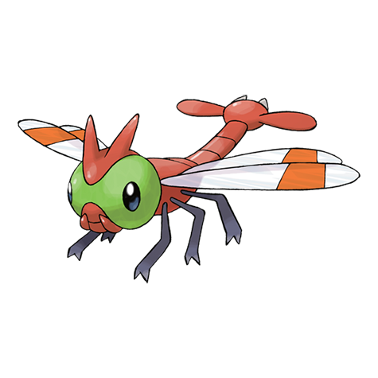

# Yanma (#0193)

*Clear Wing Pokemon*

**Type:** Insetto / Volante
**Abilities:** [[Speed Boost]], [[Compound Eyes]], [[Frisk]] *(Hidden)*
**Base HP:** 3

> It lives near water sources. Its eyes can see 360 degrees without even moving. Yanma is a great flyer capable of making sudden stops and turning midair to quickly chase down targeted prey.

---

## Statistiche (Attributes & Limits)

| Attribute | Base / Limit |
|---|---|
| **Strength** | 2/4 |
| **Dexterity** | 3/6 |
| **Vitality** | 2/4 |
| **Special** | 2/5 |
| **Insight** | 2/4 |

---

## Mosse (Learnset)

- **Starter:** [[Tackle|Tackle]], [[Foresight|Foresight]]
- **Beginner:** [[Quick_Attack|Quick Attack]], [[Double_Team|Double Team]]
- **Amateur:** [[Sonic_Boom|Sonic Boom]], [[Detect|Detect]], [[Supersonic|Supersonic]], [[Uproar|Uproar]], [[Pursuit|Pursuit]], [[Ancient_Power|Ancient Power]], [[Hypnosis|Hypnosis]], [[Wing_Attack|Wing Attack]]
- **Ace:** [[Screech|Screech]], [[U_Turn|U-Turn]], [[Air_Slash|Air Slash]], [[Bug_Buzz|Bug Buzz]]
- **Pro:** [[Feint|Feint]], [[Feint_Attack|Feint Attack]], [[Tailwind|Tailwind]]

---

## Correlati

### Catena Evolutiva
- [[0193_Yanma|Yanma]]
- Yanmega
