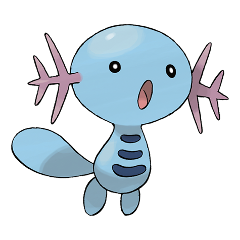

# Wooper (#0194)

*Water Fish Pokemon*

**Type:** Acqua / Terra
**Abilities:** [[Damp]], [[Water Absorb]], [[Unaware]] *(Hidden)*
**Base HP:** 3

> Inhabits cold water sources and only comes out during the evening when the land has cooled, to find something to eat. Under this ideal environment it has rarely been seen at its evolved stage.

---

## Statistiche (Attributes & Limits)

| Attribute | Base / Limit |
|---|---|
| **Strength** | 2/4 |
| **Dexterity** | 1/2 |
| **Vitality** | 2/4 |
| **Special** | 1/3 |
| **Insight** | 1/3 |

---

## Mosse (Learnset)

- **Starter:** [[Water_Gun|Water Gun]], [[Tail_Whip|Tail Whip]]
- **Beginner:** [[Mud_Sport|Mud Sport]], [[Mud_Shot|Mud Shot]]
- **Amateur:** [[Slam|Slam]], [[Mud_Bomb|Mud Bomb]], [[Amnesia|Amnesia]], [[Yawn|Yawn]], [[Mist|Mist]], [[Muddy_Water|Muddy Water]]
- **Ace:** [[Rain_Dance|Rain Dance]], [[Haze|Haze]], [[Earthquake|Earthquake]]
- **Pro:** [[Curse|Curse]], [[Ancient_Power|Ancient Power]], [[Ice_Punch|Ice Punch]]

---

## Correlati

### Catena Evolutiva
- [[0194_Wooper|Wooper]]
- [[0195_Quagsire|Quagsire]]
