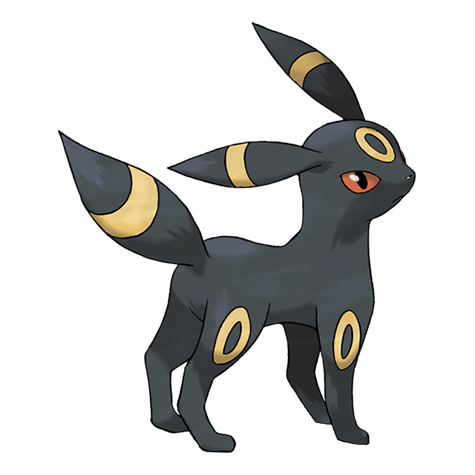

# Umbreon (#0197)

*Moonlight Pokemon*

**Type:** Buio
**Abilities:** [[Synchronize]], [[Inner Focus]] *(Hidden)*
**Base HP:** 4

> Umbreon evolved from exposure to the moon’s energy pulses. It lurks in darkness and waits for its foes to move. The rings on its body glow when it leaps to attack. Its fur is drenched with poison.

---

## Statistiche (Attributes & Limits)

| Attribute | Base / Limit |
|---|---|
| **Strength** | 2/4 |
| **Dexterity** | 2/4 |
| **Vitality** | 3/6 |
| **Special** | 2/4 |
| **Insight** | 3/7 |

---

## Mosse (Learnset)

- **Starter:** [[Tackle|Tackle]], [[Tail_Whip|Tail Whip]], [[Helping_Hand|Helping Hand]]
- **Beginner:** [[Sand_Attack|Sand Attack]], [[Pursuit|Pursuit]], [[Quick_Attack|Quick Attack]]
- **Amateur:** [[Confuse_Ray|Confuse Ray]], [[Feint_Attack|Feint Attack]], [[Assurance|Assurance]], [[Screech|Screech]], [[Moonlight|Moonlight]], [[Mean_Look|Mean Look]]
- **Ace:** [[Last_Resort|Last Resort]], [[Guard_Swap|Guard Swap]]
- **Pro:** [[Wish|Wish]], [[Curse|Curse]], [[Foul_Play|Foul Play]]

---

