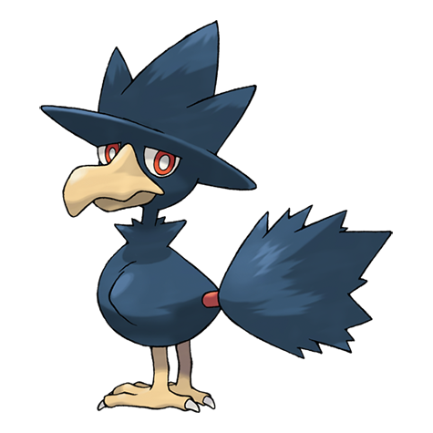

# Murkrow (#0198)

*Darkness Pokemon*

**Type:** Buio / Volante
**Abilities:** [[Insomnia]], [[Super Luck]], [[Prankster]] *(Hidden)*
**Base HP:** 3

> Murkrows are feared and loathed as the alleged bearers of ill fortune. This Pokemon will steal anything that sparkles. They are infamous for luring people and get them lost in the mountains.

---

## Statistiche (Attributes & Limits)

| Attribute | Base / Limit |
|---|---|
| **Strength** | 2/5 |
| **Dexterity** | 1/3 |
| **Vitality** | 2/5 |
| **Special** | 2/5 |
| **Insight** | 1/3 |

---

## Mosse (Learnset)

- **Starter:** [[Peck|Peck]], [[Astonish|Astonish]]
- **Beginner:** [[Pursuit|Pursuit]], [[Haze|Haze]]
- **Amateur:** [[Wing_Attack|Wing Attack]], [[Night_Shade|Night Shade]], [[Assurance|Assurance]], [[Taunt|Taunt]], [[Feint_Attack|Feint Attack]], [[Mean_Look|Mean Look]], [[Foul_Play|Foul Play]]
- **Ace:** [[Tailwind|Tailwind]], [[Sucker_Punch|Sucker Punch]], [[Torment|Torment]], [[Quash|Quash]]
- **Pro:** [[Drill_Peck|Drill Peck]], [[Roost|Roost]], [[Perish_Song|Perish Song]]

---

## Correlati

### Catena Evolutiva
- [[0198_Murkrow|Murkrow]]
- Honchkrow
