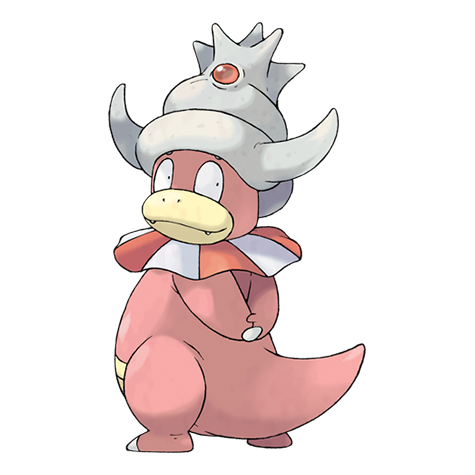

# Slowking (#0199)

*Royal Pokemon*

**Type:** Acqua / Psico
**Abilities:** [[Oblivious]], [[Own Tempo]], [[Regenerator]] *(Hidden)*
**Base HP:** 4

> It is extremely rare. The Shellder on its head injects a poison that made it super intelligent. It takes a lot of interest in learning about Pokemon lore and legends. But if Shellder is knocked out it will forget everything.

---

## Statistiche (Attributes & Limits)

| Attribute | Base / Limit |
|---|---|
| **Strength** | 2/5 |
| **Dexterity** | 1/3 |
| **Vitality** | 2/5 |
| **Special** | 3/6 |
| **Insight** | 3/6 |

---

## Mosse (Learnset)

- **Starter:** [[Tackle|Tackle]], [[Yawn|Yawn]]
- **Beginner:** [[Growl|Growl]], [[Water_Gun|Water Gun]], [[Confusion|Confusion]]
- **Amateur:** [[Power_Gem|Power Gem]], [[Disable|Disable]], [[Curse|Curse]], [[Water_Pulse|Water Pulse]], [[Headbutt|Headbutt]], [[Nasty_Plot|Nasty Plot]], [[Zen_Headbutt|Zen Headbutt]], [[Psychic|Psychic]]
- **Ace:** [[Swagger|Swagger]], [[Hidden_Power|Hidden Power]], [[Trump_Card|Trump Card]], [[Psych_Up|Psych Up]], [[Heal_Pulse|Heal Pulse]]
- **Pro:** [[Future_Sight|Future Sight]], [[Foul_Play|Foul Play]], [[Brine|Brine]]

---

