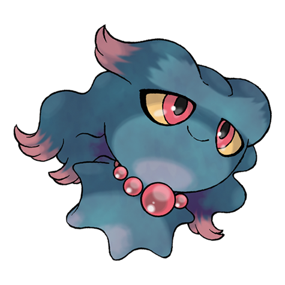

# Misdreavus (#0200)

*Screech Pokemon*

**Type:** Spettro
**Abilities:** [[Levitate]]
**Base HP:** 3

> Misdreavus frightens people with a creepy, sobbing cry. It uses the red spheres on its neck to absorb fear as nutrition. It takes a wicked pleasure in startling and scaring people.

---

## Statistiche (Attributes & Limits)

| Attribute | Base / Limit |
|---|---|
| **Strength** | 2/4 |
| **Dexterity** | 2/5 |
| **Vitality** | 2/4 |
| **Special** | 2/5 |
| **Insight** | 2/5 |

---

## Mosse (Learnset)

- **Starter:** [[Growl|Growl]], [[Psywave|Psywave]]
- **Beginner:** [[Spite|Spite]], [[Astonish|Astonish]]
- **Amateur:** [[Confuse_Ray|Confuse Ray]], [[Mean_Look|Mean Look]], [[Hex|Hex]], [[Psybeam|Psybeam]], [[Pain_Split|Pain Split]], [[Payback|Payback]], [[Shadow_Ball|Shadow Ball]]
- **Ace:** [[Perish_Song|Perish Song]], [[Grudge|Grudge]], [[Power_Gem|Power Gem]]
- **Pro:** [[Shadow_Sneak|Shadow Sneak]], [[Icy_Wind|Icy Wind]], [[Nasty_Plot|Nasty Plot]]

---

## Correlati

### Catena Evolutiva
- [[0200_Misdreavus|Misdreavus]]
- Mismagius
