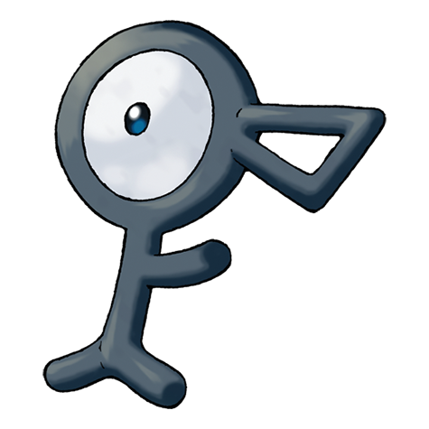

# Unown (#0201)

*Symbol Pokemon*

**Type:** Psico
**Abilities:** [[Levitate]]
**Base HP:** 4

> There are depictions of it in ancient ruins. When Unowns are gathered together, it is said that a strange power capable of anything emerges. They are all shaped like letters, each one of them with a unique power.

---

## Statistiche (Attributes & Limits)

| Attribute | Base / Limit |
|---|---|
| **Strength** | 2/5 |
| **Dexterity** | 2/4 |
| **Vitality** | 2/4 |
| **Special** | 2/5 |
| **Insight** | 2/4 |

---

## Mosse (Learnset)

- **Starter:** [[Hidden_Power|Hidden Power]]

---

