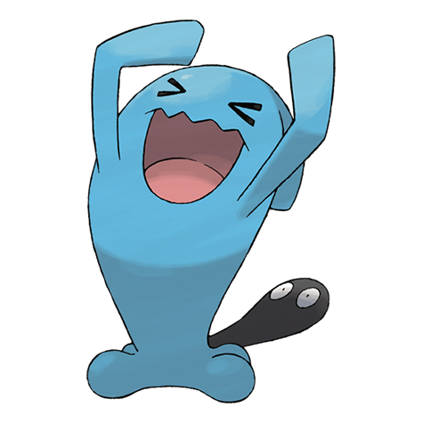

# Wobbuffet (#0202)

*Patient Pokemon*

**Type:** Psico
**Abilities:** [[Shadow Tag]], [[Telepathy]] *(Hidden)*
**Base HP:** 9

> Wobbuffet looks somewhat deflated until it senses an aggressor, then it inflates. It will do nothing besides endure and counter attacks. It always keeps its black tail hidden, the reasons are still a mystery.

---

## Statistiche (Attributes & Limits)

| Attribute | Base / Limit |
|---|---|
| **Strength** | 1/3 |
| **Dexterity** | 1/3 |
| **Vitality** | 3/6 |
| **Special** | 1/3 |
| **Insight** | 3/6 |

---

## Mosse (Learnset)

- **Beginner:** [[Counter|Counter]]
- **Amateur:** [[Safeguard|Safeguard]], [[Mirror_Coat|Mirror Coat]]
- **Pro:** [[Destiny_Bond|Destiny Bond]]

---

