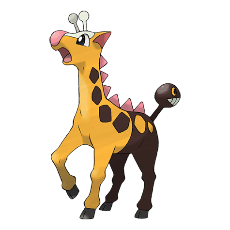

# Girafarig (#0203)

*Long Neck Pokemon*

**Type:** Normale / Psico
**Abilities:** [[Inner Focus]], [[Early Bird]], [[Sap Sipper]] *(Hidden)*
**Base HP:** 4

> Its tail is a head on its own, it bites if anything comes close and never rests. Some say that the sum of its two heads grant it psychic powers. Even if that’s true, the tail isn’t very bright, but it is quite vicious.

---

## Statistiche (Attributes & Limits)

| Attribute | Base / Limit |
|---|---|
| **Strength** | 2/5 |
| **Dexterity** | 2/5 |
| **Vitality** | 2/4 |
| **Special** | 2/5 |
| **Insight** | 2/4 |

---

## Mosse (Learnset)

- **Starter:** [[Astonish|Astonish]], [[Confusion|Confusion]], [[Growl|Growl]], [[Guard_Swap|Guard Swap]], [[Power_Swap|Power Swap]], [[Tackle|Tackle]]
- **Beginner:** [[Odor_Sleuth|Odor Sleuth]], [[Stomp|Stomp]]
- **Amateur:** [[Agility|Agility]], [[Psybeam|Psybeam]], [[Baton_Pass|Baton Pass]], [[Assurance|Assurance]], [[Double_Hit|Double Hit]]
- **Ace:** [[Psychic|Psychic]], [[Zen_Headbutt|Zen Headbutt]], [[Crunch|Crunch]], [[Nasty_Plot|Nasty Plot]]
- **Pro:** [[Future_Sight|Future Sight]], [[Hyper_Voice|Hyper Voice]], [[Sucker_Punch|Sucker Punch]]

---

