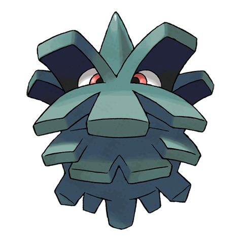

# Pineco (#0204)

*Bagworm Pokemon*

**Type:** Insetto
**Abilities:** [[Sturdy]], [[Overcoat]] *(Hidden)*
**Base HP:** 3

> Pineco looks just like a regular pine cone. It adds layers of tree bark as a shield from harm. It waits for bugs to eat while hanging from branches. If anyone shakes its tree, it falls down and explodes. Be very careful.

---

## Statistiche (Attributes & Limits)

| Attribute | Base / Limit |
|---|---|
| **Strength** | 2/4 |
| **Dexterity** | 1/2 |
| **Vitality** | 2/5 |
| **Special** | 1/3 |
| **Insight** | 1/3 |

---

## Mosse (Learnset)

- **Starter:** [[Protect|Protect]], [[Tackle|Tackle]]
- **Beginner:** [[Self_Destruct|Self Destruct]], [[Bug_Bite|Bug Bite]], [[Take_Down|Take Down]]
- **Amateur:** [[Rapid_Spin|Rapid Spin]], [[Bide|Bide]], [[Natural_Gift|Natural Gift]], [[Spikes|Spikes]], [[Payback|Payback]], [[Iron_Defense|Iron Defense]]
- **Ace:** [[Explosion|Explosion]], [[Gyro_Ball|Gyro Ball]], [[Double_Edge|Double-Edge]]
- **Pro:** [[Stealth_Rock|Stealth Rock]], [[Secret_Power|Secret Power]], [[Pin_Missile|Pin Missile]]

---

## Correlati

### Catena Evolutiva
- [[0204_Pineco|Pineco]]
- [[0205_Forretress|Forretress]]
