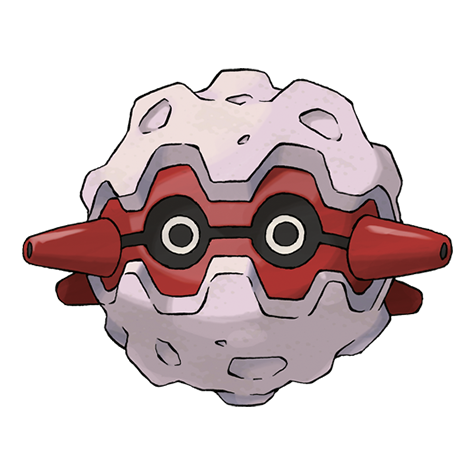

# Forretress (#0205)

*Bagworm Pokemon*

**Type:** Insetto / Acciaio
**Abilities:** [[Sturdy]], [[Overcoat]] *(Hidden)*
**Base HP:** 4

> It can be found completely rooted to huge tree trunks. It protects itself and its tree by scattering spiked pieces from its shell and turning its home into a fortress that won’t go down without a fight.

---

## Statistiche (Attributes & Limits)

| Attribute | Base / Limit |
|---|---|
| **Strength** | 2/5 |
| **Dexterity** | 1/3 |
| **Vitality** | 3/7 |
| **Special** | 2/4 |
| **Insight** | 2/4 |

---

## Mosse (Learnset)

- **Starter:** [[Tackle|Tackle]], [[Protect|Protect]]
- **Beginner:** [[Bug_Bite|Bug Bite]], [[Self_Destruct|Self Destruct]]
- **Amateur:** [[Toxic_Spikes|Toxic Spikes]], [[Zap_Cannon|Zap Cannon]], [[Take_Down|Take Down]], [[Rapid_Spin|Rapid Spin]], [[Bide|Bide]], [[Natural_Gift|Natural Gift]], [[Spikes|Spikes]], [[Mirror_Shot|Mirror Shot]], [[Autotomize|Autotomize]], [[Payback|Payback]], [[Iron_Defense|Iron Defense]]
- **Ace:** [[Magnet_Rise|Magnet Rise]], [[Explosion|Explosion]], [[Heavy_Slam|Heavy Slam]], [[Gyro_Ball|Gyro Ball]], [[Double_Edge|Double-Edge]]
- **Pro:** [[Stealth_Rock|Stealth Rock]], [[Power_Trick|Power Trick]], [[Endure|Endure]]

---

## Correlati

### Catena Evolutiva
- [[0204_Pineco|Pineco]]
- [[0205_Forretress|Forretress]]
