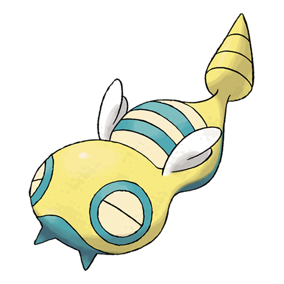

# Dunsparce (#0206)

*Land Snake Pokemon*

**Type:** Normale
**Abilities:** [[Serene Grace]], [[Run Away]], [[Rattled]] *(Hidden)*
**Base HP:** 5

> If seen, Dunsparce is quick to escape by boring into the ground with its drill tail. It can float slightly with its wings. It is almost blind but finds its way in the huge underground mazes where it lives.

---

## Statistiche (Attributes & Limits)

| Attribute | Base / Limit |
|---|---|
| **Strength** | 2/5 |
| **Dexterity** | 2/4 |
| **Vitality** | 2/5 |
| **Special** | 2/4 |
| **Insight** | 2/4 |

---

## Mosse (Learnset)

- **Starter:** [[Defense_Curl|Defense Curl]], [[Rage|Rage]]
- **Beginner:** [[Rollout|Rollout]], [[Spite|Spite]], [[Pursuit|Pursuit]]
- **Amateur:** [[Screech|Screech]], [[Yawn|Yawn]], [[Body_Slam|Body Slam]], [[Ancient_Power|Ancient Power]], [[Take_Down|Take Down]], [[Dig|Dig]], [[Glare|Glare]], [[Coil|Coil]], [[Endure|Endure]], [[Air_Slash|Air Slash]], [[Dragon_Rush|Dragon Rush]], [[Drill_Run|Drill Run]]
- **Ace:** [[Double_Edge|Double-Edge]], [[Roost|Roost]], [[Endeavor|Endeavor]], [[Flail|Flail]]
- **Pro:** [[Magic_Coat|Magic Coat]], [[Agility|Agility]], [[Trump_Card|Trump Card]]

---

