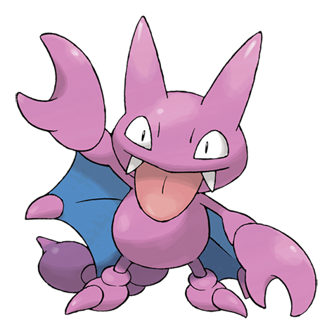

# Gligar (#0207)

*Fly Scorpion Pokemon*

**Type:** Terra / Volante
**Abilities:** [[Hyper Cutter]], [[Sand Veil]], [[Immunity]] *(Hidden)*
**Base HP:** 3

> It hangs from cliffs waiting for its prey. It flies straight at the target’s face, grapples the victim with its pincers and clawed hind legs, lastly, it injects poison with its tail. Gligar can glide without making any noise.

---

## Statistiche (Attributes & Limits)

| Attribute | Base / Limit |
|---|---|
| **Strength** | 2/5 |
| **Dexterity** | 2/5 |
| **Vitality** | 3/6 |
| **Special** | 1/3 |
| **Insight** | 2/4 |

---

## Mosse (Learnset)

- **Starter:** [[Poison_Sting|Poison Sting]]
- **Beginner:** [[Sand_Attack|Sand Attack]], [[Harden|Harden]], [[Knock_Off|Knock Off]]
- **Amateur:** [[Quick_Attack|Quick Attack]], [[Fury_Cutter|Fury Cutter]], [[Feint_Attack|Feint Attack]], [[Acrobatics|Acrobatics]], [[Slash|Slash]], [[U_Turn|U-Turn]], [[Screech|Screech]], [[Sky_Uppercut|Sky Uppercut]]
- **Ace:** [[X_Scissor|X-Scissor]], [[Swords_Dance|Swords Dance]], [[Guillotine|Guillotine]]
- **Pro:** [[Iron_Tail|Iron Tail]], [[Poison_Tail|Poison Tail]], [[Feint|Feint]]

---

## Correlati

### Catena Evolutiva
- [[0207_Gligar|Gligar]]
- Gliscor
