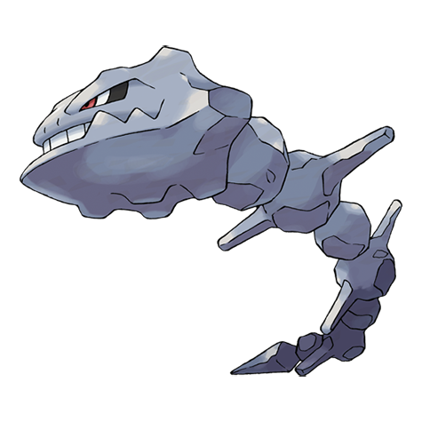

# Steelix (#0208)

*Iron Snake Pokemon*

**Type:** Acciaio / Terra
**Abilities:** [[Rock Head]], [[Sturdy]], [[Sheer Force]] *(Hidden)*
**Base HP:** 9

> Some say that when an Onix lives underground for 100 years it’s body becomes hard as steel. Steelix lives deep underground, tempered by high pressure and heat. It can see in the darkness.

---

## Statistiche (Attributes & Limits)

| Attribute | Base / Limit |
|---|---|
| **Strength** | 2/5 |
| **Dexterity** | 1/3 |
| **Vitality** | 5/10 |
| **Special** | 2/4 |
| **Insight** | 2/4 |

---

## Mosse (Learnset)

- **Starter:** [[Bind|Bind]], [[Fire_Fang|Fire Fang]], [[Harden|Harden]], [[Ice_Fang|Ice Fang]], [[Mud_Sport|Mud Sport]], [[Thunder_Fang|Thunder Fang]]
- **Beginner:** [[Curse|Curse]], [[Rock_Throw|Rock Throw]]
- **Amateur:** [[Rock_Tomb|Rock Tomb]], [[Rage|Rage]], [[Stealth_Rock|Stealth Rock]], [[Autotomize|Autotomize]], [[Gyro_Ball|Gyro Ball]], [[Smack_Down|Smack Down]], [[Dragon_Breath|Dragon Breath]], [[Slam|Slam]], [[Screech|Screech]], [[Rock_Slide|Rock Slide]], [[Crunch|Crunch]], [[Iron_Tail|Iron Tail]], [[Dig|Dig]]
- **Ace:** [[Sandstorm|Sandstorm]], [[Stone_Edge|Stone Edge]], [[Double_Edge|Double-Edge]]
- **Pro:** [[Ancient_Power|Ancient Power]], [[Aqua_Tail|Aqua Tail]], [[Twister|Twister]]

---

## Correlati

### Catena Evolutiva
- [[0208_Steelix|Steelix]]
- Steelix (Mega Form)

---

## Mega Steelix (#0208M1)

**Type:** Acciaio / Terra
**Abilities:** [[Sand Force]]
**Base HP:** 10

| Attribute | Base / Limit |
|---|---|
| **Strength** | 3/7 |
| **Dexterity** | 1/2 |
| **Vitality** | 5/11 |
| **Special** | 2/4 |
| **Insight** | 3/6 |

### Mosse

- **Starter:** [[Bind|Bind]], [[Fire_Fang|Fire Fang]], [[Harden|Harden]], [[Ice_Fang|Ice Fang]], [[Mud_Sport|Mud Sport]], [[Thunder_Fang|Thunder Fang]]
- **Beginner:** [[Curse|Curse]], [[Rock_Throw|Rock Throw]]
- **Amateur:** [[Rock_Tomb|Rock Tomb]], [[Rage|Rage]], [[Stealth_Rock|Stealth Rock]], [[Autotomize|Autotomize]], [[Gyro_Ball|Gyro Ball]], [[Smack_Down|Smack Down]], [[Dragon_Breath|Dragon Breath]], [[Slam|Slam]], [[Screech|Screech]], [[Rock_Slide|Rock Slide]], [[Crunch|Crunch]], [[Iron_Tail|Iron Tail]], [[Dig|Dig]]
- **Ace:** [[Sandstorm|Sandstorm]], [[Stone_Edge|Stone Edge]], [[Double_Edge|Double-Edge]]
- **Pro:** [[Ancient_Power|Ancient Power]], [[Aqua_Tail|Aqua Tail]], [[Twister|Twister]]
