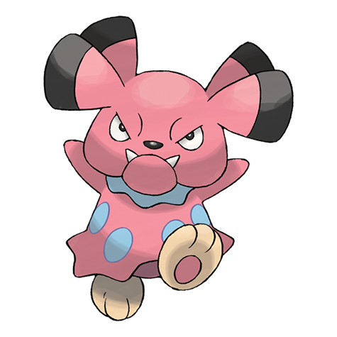

# Snubbull (#0209)

*Fairy Pokemon*

**Type:** Folletto
**Abilities:** [[Intimidate]], [[Run Away]], [[Rattled]] *(Hidden)*
**Base HP:** 3

> It may look frightening but it is a loving and caring creature, active and playful. Snubbulls are easily scared. When threatened by bigger foes they run away or make scary faces, that makes them sad though.

---

## Statistiche (Attributes & Limits)

| Attribute | Base / Limit |
|---|---|
| **Strength** | 2/5 |
| **Dexterity** | 1/3 |
| **Vitality** | 2/4 |
| **Special** | 1/3 |
| **Insight** | 1/3 |

---

## Mosse (Learnset)

- **Starter:** [[Tackle|Tackle]], [[Tail_Whip|Tail Whip]]
- **Beginner:** [[Charm|Charm]], [[Scary_Face|Scary Face]]
- **Amateur:** [[Fire_Fang|Fire Fang]], [[Ice_Fang|Ice Fang]], [[Thunder_Fang|Thunder Fang]], [[Bite|Bite]], [[Lick|Lick]], [[Headbutt|Headbutt]], [[Rage|Rage]]
- **Ace:** [[Roar|Roar]], [[Play_Rough|Play Rough]], [[Payback|Payback]], [[Crunch|Crunch]]
- **Pro:** [[Heal_Bell|Heal Bell]], [[Present|Present]], [[Fake_Tears|Fake Tears]]

---

## Correlati

### Catena Evolutiva
- [[0209_Snubbull|Snubbull]]
- [[0210_Granbull|Granbull]]
