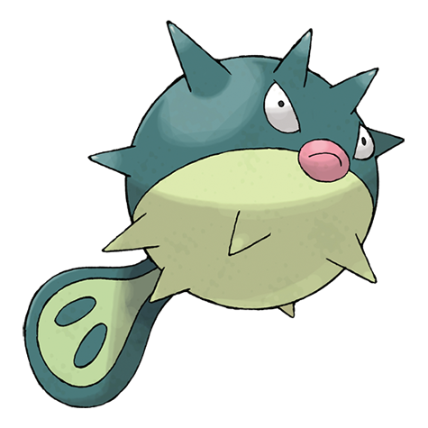

# Qwilfish (#0211)

*Balloon Pokemon*

**Type:** Acqua / Veleno
**Abilities:** [[Poison Point]], [[Swift Swim]], [[Intimidate]] *(Hidden)*
**Base HP:** 4

> It swallows water to inflate its body to appear bigger than its foes. Qwilfish must swallow 2 gallons of water to be able to shoot its stings. The poison produced by Qwilfish is known to cause fainting.

---

## Statistiche (Attributes & Limits)

| Attribute | Base / Limit |
|---|---|
| **Strength** | 3/6 |
| **Dexterity** | 2/5 |
| **Vitality** | 2/5 |
| **Special** | 2/4 |
| **Insight** | 2/4 |

---

## Mosse (Learnset)

- **Starter:** [[Supersonic|Supersonic]], [[Fell_Stinger|Fell Stinger]], [[Spikes|Spikes]], [[Poison_Sting|Poison Sting]], [[Water_Gun|Water Gun]], [[Tackle|Tackle]]
- **Beginner:** [[Minimize|Minimize]], [[Harden|Harden]]
- **Amateur:** [[Destiny_Bond|Destiny Bond]], [[Bubble|Bubble]], [[Rollout|Rollout]], [[Toxic_Spikes|Toxic Spikes]], [[Stockpile|Stockpile]], [[Spit_Up|Spit Up]], [[Revenge|Revenge]], [[Brine|Brine]], [[Pin_Missile|Pin Missile]], [[Take_Down|Take Down]]
- **Ace:** [[Aqua_Tail|Aqua Tail]], [[Poison_Jab|Poison Jab]], [[Hydro_Pump|Hydro Pump]]
- **Pro:** [[Aqua_Jet|Aqua Jet]], [[Self_Destruct|Self Destruct]], [[Swords_Dance|Swords Dance]]

---

