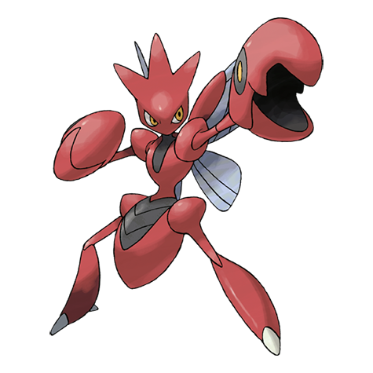

# Scizor (#0212)

*Pincer Pokemon*

**Type:** Insetto / Acciaio
**Abilities:** [[Swarm]], [[Technician]], [[Light Metal]] *(Hidden)*
**Base HP:** 4

> Its pincers appear to be two more heads and its wings are not for flying, but to regulate its body temperature. Scizor's body can shrug off most attacks and its pincers can crush almost any object.

---

## Statistiche (Attributes & Limits)

| Attribute | Base / Limit |
|---|---|
| **Strength** | 3/7 |
| **Dexterity** | 2/4 |
| **Vitality** | 3/6 |
| **Special** | 2/4 |
| **Insight** | 2/4 |

---

## Mosse (Learnset)

- **Starter:** [[Leer|Leer]], [[Feint|Feint]], [[Quick_Attack|Quick Attack]]
- **Beginner:** [[Pursuit|Pursuit]], [[Focus_Energy|Focus Energy]], [[False_Swipe|False Swipe]]
- **Amateur:** [[Agility|Agility]], [[Fury_Cutter|Fury Cutter]], [[Metal_Claw|Metal Claw]], [[Razor_Wind|Razor Wind]], [[Slash|Slash]], [[X_Scissor|X-Scissor]], [[Night_Slash|Night Slash]], [[Double_Hit|Double Hit]]
- **Ace:** [[Iron_Defense|Iron Defense]], [[Bullet_Punch|Bullet Punch]], [[Iron_Head|Iron Head]], [[Swords_Dance|Swords Dance]]
- **Pro:** [[Steel_Wing|Steel Wing]], [[Knock_Off|Knock Off]], [[Superpower|Superpower]]

---

## Correlati

### Catena Evolutiva
- [[0212_Scizor|Scizor]]
- Scizor (Mega Form)
