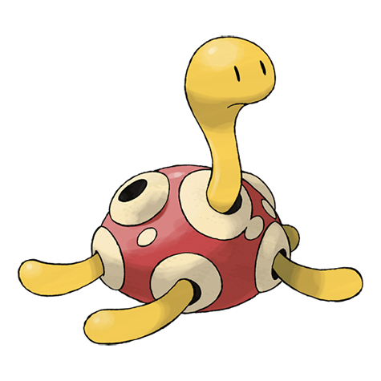

# Shuckle (#0213)

*Mold Pokemon*

**Type:** Insetto / Roccia
**Abilities:** [[Sturdy]], [[Gluttony]], [[Contrary]] *(Hidden)*
**Base HP:** 4

> Shuckle is a very peaceful and patient gooey worm. The fluids secreted by its toes can make holes in rocks. It hides inside those hallow stones and wears them as a shell. It is known for storing berries inside.

---

## Statistiche (Attributes & Limits)

| Attribute | Base / Limit |
|---|---|
| **Strength** | 1/2 |
| **Dexterity** | 1/2 |
| **Vitality** | 5/10 |
| **Special** | 1/2 |
| **Insight** | 5/10 |

---

## Mosse (Learnset)

- **Starter:** [[Bide|Bide]], [[Constrict|Constrict]], [[Rollout|Rollout]], [[Sticky_Web|Sticky Web]], [[Withdraw|Withdraw]]
- **Beginner:** [[Encore|Encore]], [[Wrap|Wrap]], [[Struggle_Bug|Struggle Bug]]
- **Amateur:** [[Safeguard|Safeguard]], [[Rest|Rest]], [[Rock_Throw|Rock Throw]], [[Gastro_Acid|Gastro Acid]], [[Power_Trick|Power Trick]], [[Shell_Smash|Shell Smash]], [[Bug_Bite|Bug Bite]]
- **Ace:** [[Rock_Slide|Rock Slide]], [[Guard_Split|Guard Split]], [[Power_Split|Power Split]], [[Stone_Edge|Stone Edge]]
- **Pro:** [[Infestation|Infestation]], [[Stealth_Rock|Stealth Rock]], [[Acupressure|Acupressure]]

---

