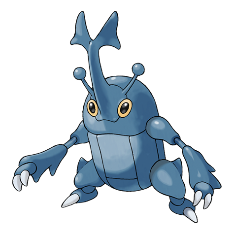
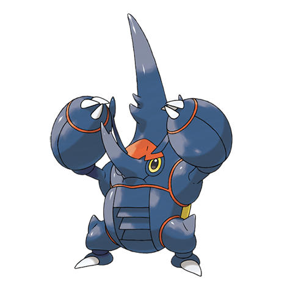

# Heracross (#0214)

*Single Horn Pokemon*

**Type:** Insetto / Lotta
**Abilities:** [[Swarm]], [[Guts]], [[Moxie]] *(Hidden)*
**Base HP:** 4

> A docile creature that loves honey. They batter down trees with their powerful horn and chase off anyone who gets close to their prized honey. Not many Pokemon dare to mess with it in the wild.

---

## Statistiche (Attributes & Limits)

| Attribute | Base / Limit |
|---|---|
| **Strength** | 3/6 |
| **Dexterity** | 2/5 |
| **Vitality** | 2/5 |
| **Special** | 1/3 |
| **Insight** | 3/6 |

---

## Mosse (Learnset)

- **Starter:** [[Endure|Endure]], [[Horn_Attack|Horn Attack]], [[Leer|Leer]], [[Night_Slash|Night Slash]], [[Tackle|Tackle]]
- **Beginner:** [[Fury_Attack|Fury Attack]], [[Aerial_Ace|Aerial Ace]]
- **Amateur:** [[Arm_Thrust|Arm Thrust]], [[Bullet_Seed|Bullet Seed]], [[Chip_Away|Chip Away]], [[Counter|Counter]], [[Brick_Break|Brick Break]], [[Take_Down|Take Down]], [[Pin_Missile|Pin Missile]]
- **Ace:** [[Close_Combat|Close Combat]], [[Feint|Feint]], [[Reversal|Reversal]], [[Megahorn|Megahorn]]
- **Pro:** [[Rock_Blast|Rock Blast]], [[Vacuum_Wave|Vacuum Wave]], [[Iron_Defense|Iron Defense]]

---

## Correlati

### Catena Evolutiva
- [[0214_Heracross|Heracross]]
- Heracross (Mega Form)

---

## Mega Heracross (#0214M1)

**Type:** Insetto / Lotta
**Abilities:** [[Skill Link]]
**Base HP:** 5

| Attribute | Base / Limit |
|---|---|
| **Strength** | 4/9 |
| **Dexterity** | 2/5 |
| **Vitality** | 3/6 |
| **Special** | 1/2 |
| **Insight** | 3/6 |

### Mosse

- **Starter:** [[Endure|Endure]], [[Horn_Attack|Horn Attack]], [[Leer|Leer]], [[Night_Slash|Night Slash]], [[Tackle|Tackle]]
- **Beginner:** [[Fury_Attack|Fury Attack]], [[Aerial_Ace|Aerial Ace]]
- **Amateur:** [[Arm_Thrust|Arm Thrust]], [[Bullet_Seed|Bullet Seed]], [[Chip_Away|Chip Away]], [[Counter|Counter]], [[Brick_Break|Brick Break]], [[Take_Down|Take Down]], [[Pin_Missile|Pin Missile]]
- **Ace:** [[Close_Combat|Close Combat]], [[Feint|Feint]], [[Reversal|Reversal]], [[Megahorn|Megahorn]]
- **Pro:** [[Rock_Blast|Rock Blast]], [[Vacuum_Wave|Vacuum Wave]], [[Iron_Defense|Iron Defense]]
