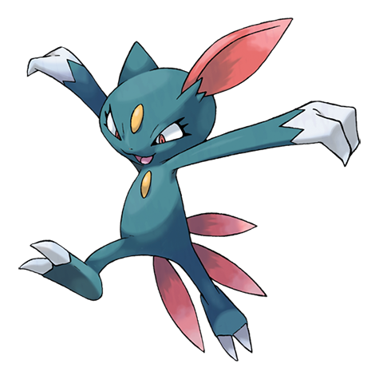

# Sneasel (#0215)

*Sharp Claw Pokemon*

**Type:** Buio / Ghiaccio
**Abilities:** [[Inner Focus]], [[Keen Eye]], [[Pickpocket]] *(Hidden)*
**Base HP:** 3

> It drives weaker Pokemon from their homes and eats their eggs. They are vicious and cunning. They wait for prey hidden in the darkness and enjoy slashing their foes until they get tired or the foe stops moving.

---

## Statistiche (Attributes & Limits)

| Attribute | Base / Limit |
|---|---|
| **Strength** | 3/6 |
| **Dexterity** | 3/6 |
| **Vitality** | 2/4 |
| **Special** | 1/3 |
| **Insight** | 2/5 |

---

## Mosse (Learnset)

- **Starter:** [[Leer|Leer]], [[Scratch|Scratch]], [[Taunt|Taunt]]
- **Beginner:** [[Quick_Attack|Quick Attack]], [[Feint_Attack|Feint Attack]]
- **Amateur:** [[Icy_Wind|Icy Wind]], [[Fury_Swipes|Fury Swipes]], [[Agility|Agility]], [[Metal_Claw|Metal Claw]], [[Hone_Claws|Hone Claws]], [[Beat_Up|Beat Up]], [[Screech|Screech]]
- **Ace:** [[Slash|Slash]], [[Snatch|Snatch]], [[Punishment|Punishment]], [[Ice_Shard|Ice Shard]]
- **Pro:** [[Ice_Punch|Ice Punch]], [[Crush_Claw|Crush Claw]], [[Fake_Out|Fake Out]]

---

## Correlati

### Catena Evolutiva
- [[0215_Sneasel|Sneasel]]
- Weavile
